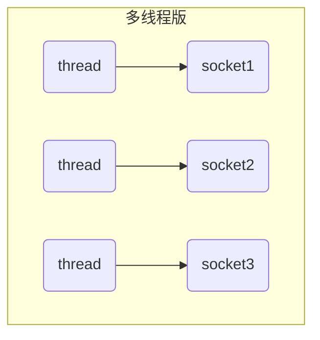
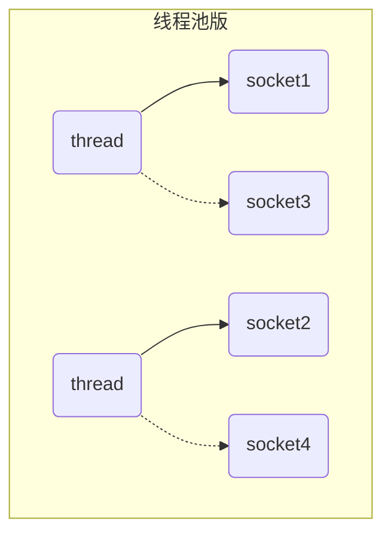
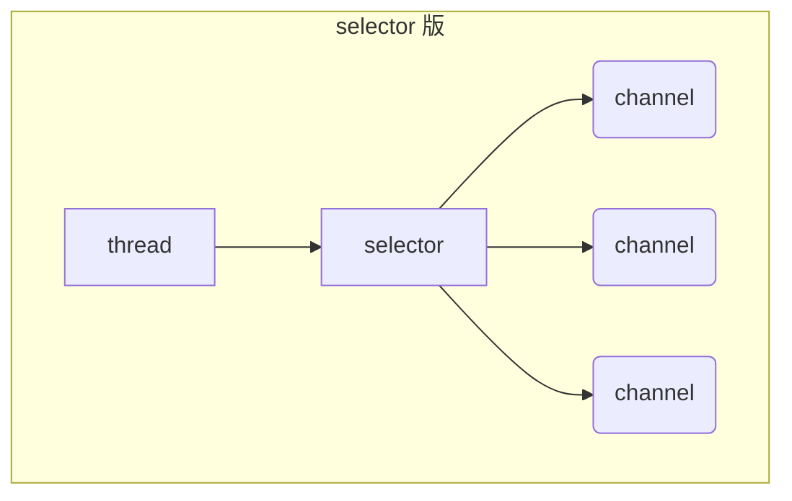
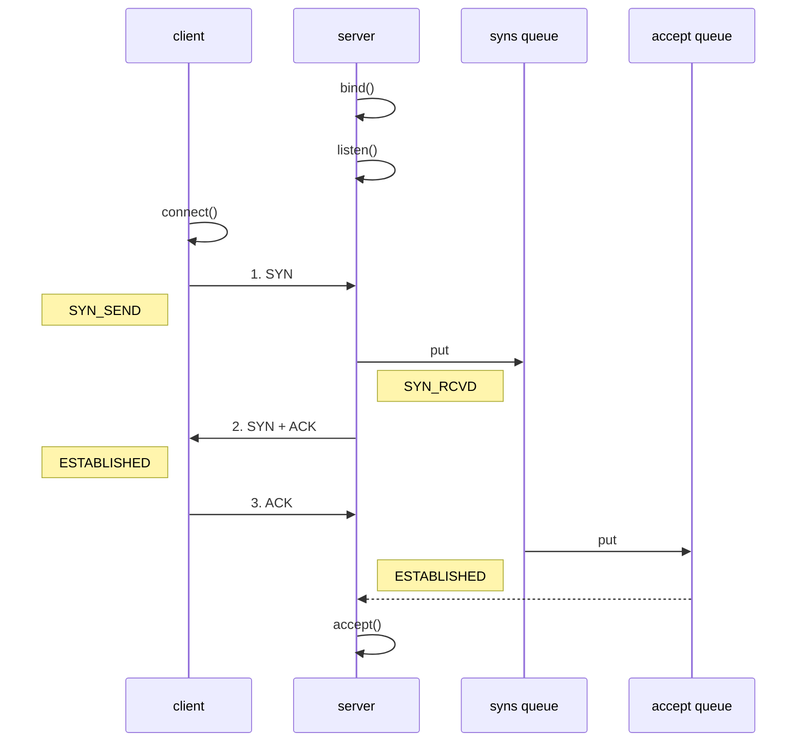

# 一、NIO基础

`NIO`（`New I/O`或者`Non-blocking I/O`）是从Java 1.4开始引入的一种新的I/O编程方式，相对于传统的IO来说，NIO更加灵活、高效、可靠，能够更好地处理海量数据和高并发场景。


## 1、三大组件

### 1.1 Channel

`Channel`是数据传输的双向通道，可以从 `channel `将数据读入 `buffer`，也可以将 `buffer` 的数据写入 `channel`，而`stream`要不就是读，要不就是写。`Channel`比`Stream`更加底层。


常见的 `Channel` 有

* `FileChannel`
* `DatagramChannel` ：用于UDP发包
* `SocketChannel`：用于TCP客户端
* `ServerSocketChannel`：用于TCP服务端


### 1.2 Buffer

Buffer是用来缓冲读写数据的。

常见的Buffer有：

* `ByteBuffer`
  * `MappedByteBuffer`
  * `DirectByteBuffer`
  * `HeapByteBuffer`
* `ShortBuffer`
* `IntBuffer`
* `LongBuffer`
* `FloatBuffer`
* `DoubleBuffer`
* `CharBuffer`


### 1.3 Selector

**多线程版设计**

一个socket连接就使用一个线程来服务，这样如果有多个socket连接，那么就有多个线程，内存占用高。同时由于存在多个线程，导致线程上下文切换成本较高



**缺点**

* 内存占用高
* 线程上下文切换成本高
* 只适合连接数少的场景


**线程池版设计**

一个线程可以服务多个socket，但是是阻塞模式的，即当前线程处理完这个socket之后，才会去处理下一个



**缺点**

* 阻塞模式下，线程仅能处理一个 socket 连接
* 仅适合短连接场景


**selector 版设计**

- `selector` 的作用就是配合一个线程来管理多个` channel`，获取这些` channel `上发生的事件，这些 `channel `工作在非阻塞模式下，不会让线程吊死在一个 `channel `上。适合连接数特别多，但流量低的场景（low traffic）

- 调用 `selector` 的` select() `会阻塞直到` channel` 发生了读写就绪事件，这些事件发生，`select `方法就会返回这些事件交给 `thread `来处理




## 2、ByteBuffer

### 2.1 ByteBuffer使用

有一文本文件 `data.txt`，内容为

```
1234567890abcd
```


使用 `FileChannel `来读取文件内容

- 向 buffer 写入数据，调用 `channel.read(buffer)`

- 调用 `flip() `切换至**读模式**

- 从 buffer 读取数据，调用 `buffer.get()`

- 调用 `clear()` 或 `compact() `切换至**写模式**，循环写入数据

```java
@Slf4j
public class ChannelDemo1 {
    public static void main(String[] args) {
        try (RandomAccessFile file = new RandomAccessFile("helloword/data.txt", "rw")) {
            FileChannel channel = file.getChannel();  // 获取channel通道
            ByteBuffer buffer = ByteBuffer.allocate(10);  // 分配10字节大小的buffer
            do {
                // 向 buffer 写入
                int len = channel.read(buffer);
                log.debug("读到字节数：{}", len);
                if (len == -1) {
                    break;
                }
                // 切换 buffer 读模式
                buffer.flip();
                while(buffer.hasRemaining()) {
                    log.debug("{}", (char)buffer.get());
                }
                // 切换 buffer 写模式
                buffer.clear();
            } while (true);
        } catch (IOException e) {
            e.printStackTrace();
        }
    }
}
```


### 2.2 ByteBuffer结构

`ByteBuffer` 有以下重要属性

* capacity
* position
* limit


1、初始状态


2、写模式下，position 是写入位置，limit 等于容量，下图表示写入了 4 个字节后的状态


3、`flip` 动作发生后，`position` 切换为读取位置，`limit `切换为读取限制


4、读取 4 个字节后的状态


5、`clear` 动作发生后的状态


7、`compact` 方法，是把未读完的部分向前压缩，然后切换至写模式


### 2.3 调试工具类

```java
public static void main(String[] args) {
    ByteBuffer buffer = ByteBuffer.allocate(10);
    buffer.put((byte) 0x61); // 'a'
    debugAll(buffer);
    buffer.put(new byte[]{0x62, 0x63, 0x64}); // b  c  d
    debugAll(buffer);
    buffer.flip();
    System.out.println(buffer.get());
    debugAll(buffer);
    buffer.compact();
    debugAll(buffer);
    buffer.put(new byte[]{0x65, 0x66});
    debugAll(buffer);
}
```

```
+--------+-------------------- all ------------------------+----------------+
position: [1], limit: [10]
         +-------------------------------------------------+
         |  0  1  2  3  4  5  6  7  8  9  a  b  c  d  e  f |
+--------+-------------------------------------------------+----------------+
|00000000| 61 00 00 00 00 00 00 00 00 00                   |a.........      |
+--------+-------------------------------------------------+----------------+


+--------+-------------------- all ------------------------+----------------+
position: [4], limit: [10]
         +-------------------------------------------------+
         |  0  1  2  3  4  5  6  7  8  9  a  b  c  d  e  f |
+--------+-------------------------------------------------+----------------+
|00000000| 61 62 63 64 00 00 00 00 00 00                   |abcd......      |
+--------+-------------------------------------------------+----------------+


97


+--------+-------------------- all ------------------------+----------------+
position: [1], limit: [4]
         +-------------------------------------------------+
         |  0  1  2  3  4  5  6  7  8  9  a  b  c  d  e  f |
+--------+-------------------------------------------------+----------------+
|00000000| 61 62 63 64 00 00 00 00 00 00                   |abcd......      |
+--------+-------------------------------------------------+----------------+


+--------+-------------------- all ------------------------+----------------+
position: [3], limit: [10]
         +-------------------------------------------------+
         |  0  1  2  3  4  5  6  7  8  9  a  b  c  d  e  f |
+--------+-------------------------------------------------+----------------+
|00000000| 62 63 64 64 00 00 00 00 00 00                   |bcdd......      |
+--------+-------------------------------------------------+----------------+


+--------+-------------------- all ------------------------+----------------+
position: [5], limit: [10]
         +-------------------------------------------------+
         |  0  1  2  3  4  5  6  7  8  9  a  b  c  d  e  f |
+--------+-------------------------------------------------+----------------+
|00000000| 62 63 64 65 66 00 00 00 00 00                   |bcdef.....      |
+--------+-------------------------------------------------+----------------+
```


### 2.4 ByteBuffer 常见方法

**分配空间**

可以使用` allocate` 方法为` ByteBuffer `分配空间，其它 buffer 类也有该方法

```java
Bytebuffer buf = ByteBuffer.allocate(16);
```

```java
public static void main(String[] args) {
    // class java.nio.HeapByteBuffer  java堆内存，读写效率低，受gc影响，gc后内存地址会移动
    System.out.println(ByteBuffer.allocate(16).getClass());
    // class java.nio.DirectByteBuffer  直接内存，读写效率高（少一次拷贝），不受gc影响，分配效率低
    System.out.println(ByteBuffer.allocateDirect(16).getClass());
}
```


**向 buffer 写入数据**

* 调用 channel 的 read 方法

  ```java
  int readBytes = channel.read(buf);
  ```

* 调用 buffer 的 put 方法

  ```java
  buf.put((byte)127);
  ```


**从 buffer 读取数据**

* 调用 channel 的 write 方法

  ```java
  int writeBytes = channel.write(buf);
  ```

* 调用 buffer 自己的 get 方法

  ```java
  byte b = buf.get();
  ```

> `get` 方法会让 position 读指针向后走，如果想重复读取数据
>
> * 可以调用 `rewind` 方法将 position 重新置为 0
> * 或者调用 `get(int i)` 方法获取索引 i 的内容，它不会移动读指针
>


**mark 和 reset**

mark 是在读取时，做一个标记，即使 position 改变，只要调用 reset 就能回到 mark 的位置

> **注意**
>
> `rewind` 和` flip` 都会清除 mark 位置
>
> - `rewind`方法就是将`position`置位0，`mark`置位-1
>
> ```java
> public final Buffer rewind() {
>     position = 0;
>     mark = -1;
>     return this;
> }
> ```
>
> - `flip`方法将`limit`置为`position`，然后将`position`置为0
>
> ```java
> public final Buffer flip() {
>     limit = position;
>     position = 0;
>     mark = -1;
>     return this;
> }
> ```


**代码示例**

```java
public static void main(String[] args) {
    ByteBuffer buffer = ByteBuffer.allocate(10);
    buffer.put(new byte[]{'a', 'b', 'c', 'd'});
    buffer.flip();

    // rewind 从头开始读
    buffer.get(new byte[4]);
    debugAll(buffer);
    buffer.rewind();
    System.out.println((char)buffer.get());
    /*
        +--------+-------------------- all ------------------------+----------------+
        position: [4], limit: [4]
                 +-------------------------------------------------+
                 |  0  1  2  3  4  5  6  7  8  9  a  b  c  d  e  f |
        +--------+-------------------------------------------------+----------------+
        |00000000| 61 62 63 64 00 00 00 00 00 00                   |abcd......      |
        +--------+-------------------------------------------------+----------------+
        a
    */
    
    
    // mark & reset
    // mark 做一个标记，记录 position 位置， reset 是将 position 重置到 mark 的位置
    System.out.println((char) buffer.get());
    System.out.println((char) buffer.get());
    buffer.mark(); // 加标记，索引2 的位置
    System.out.println((char) buffer.get());
    System.out.println((char) buffer.get());
    buffer.reset(); // 将 position 重置到索引 2
    System.out.println((char) buffer.get());
    System.out.println((char) buffer.get());
    /*
        a
        b
        c
        d
        c
        d
    */

    // get(i) 不会改变读索引的位置
    System.out.println((char) buffer.get(3));
    debugAll(buffer);
    
    /*
    	d
        +--------+-------------------- all ------------------------+----------------+
        position: [0], limit: [4]
                 +-------------------------------------------------+
                 |  0  1  2  3  4  5  6  7  8  9  a  b  c  d  e  f |
        +--------+-------------------------------------------------+----------------+
        |00000000| 61 62 63 64 00 00 00 00 00 00                   |abcd......      |
        +--------+-------------------------------------------------+----------------+
    */
}
```


### 2.5 ByteBuffer和String转换

> 使用`Charset`和`wrap`方式时，会自动切换为读模式

```java
public static void main(String[] args) {
    // 1. 字符串转为 ByteBuffer
    ByteBuffer buffer1 = ByteBuffer.allocate(16);
    buffer1.put("hello".getBytes());
    debugAll(buffer1);
    /*
        +--------+-------------------- all ------------------------+----------------+
        position: [5], limit: [16]
                 +-------------------------------------------------+
                 |  0  1  2  3  4  5  6  7  8  9  a  b  c  d  e  f |
        +--------+-------------------------------------------------+----------------+
        |00000000| 68 65 6c 6c 6f 00 00 00 00 00 00 00 00 00 00 00 |hello...........|
        +--------+-------------------------------------------------+----------------+
     */

    // 2. Charset
    ByteBuffer buffer2 = StandardCharsets.UTF_8.encode("hello");
    debugAll(buffer2);
    /*
        +--------+-------------------- all ------------------------+----------------+
        position: [0], limit: [5]
                 +-------------------------------------------------+
                 |  0  1  2  3  4  5  6  7  8  9  a  b  c  d  e  f |
        +--------+-------------------------------------------------+----------------+
        |00000000| 68 65 6c 6c 6f                                  |hello           |
        +--------+-------------------------------------------------+----------------+
     */

    // 3. wrap
    ByteBuffer buffer3 = ByteBuffer.wrap("hello".getBytes());
    debugAll(buffer3);
    /*
       +--------+-------------------- all ------------------------+----------------+
       position: [0], limit: [5]
                +-------------------------------------------------+
                |  0  1  2  3  4  5  6  7  8  9  a  b  c  d  e  f |
       +--------+-------------------------------------------------+----------------+
       |00000000| 68 65 6c 6c 6f                                  |hello           |
       +--------+-------------------------------------------------+----------------+
    */

    // 4. 转为字符串
    String str2 = StandardCharsets.UTF_8.decode(buffer2).toString();
    System.out.println(str2);

    buffer1.flip(); // buffer1为写模式，需要先转为读模式才能读取到数据
    String str1 = StandardCharsets.UTF_8.decode(buffer1).toString();
    System.out.println(str1);

}
```


### 2.6 Scattering Reads

有一个文本文件

```
onetwothree
```

- 如果将文件中的数据读取到一个`ByteBuffer`中，然后进行拆分，性能较差，多了一次数据拷贝的动作

- 使用如下方式读取，可以将数据直接填充至多个 buffer

```java
public static void main(String[] args) {
    try (FileChannel channel = new RandomAccessFile("words.txt", "r").getChannel()) {
        ByteBuffer b1 = ByteBuffer.allocate(3);
        ByteBuffer b2 = ByteBuffer.allocate(3);
        ByteBuffer b3 = ByteBuffer.allocate(5);
        channel.read(new ByteBuffer[]{b1, b2, b3});
        b1.flip();
        b2.flip();
        b3.flip();
        debugAll(b1);
        debugAll(b2);
        debugAll(b3);
    } catch (IOException e) {
    }
}
```

```
+--------+-------------------- all ------------------------+----------------+
position: [0], limit: [3]
         +-------------------------------------------------+
         |  0  1  2  3  4  5  6  7  8  9  a  b  c  d  e  f |
+--------+-------------------------------------------------+----------------+
|00000000| 6f 6e 65                                        |one             |
+--------+-------------------------------------------------+----------------+

+--------+-------------------- all ------------------------+----------------+
position: [0], limit: [3]
         +-------------------------------------------------+
         |  0  1  2  3  4  5  6  7  8  9  a  b  c  d  e  f |
+--------+-------------------------------------------------+----------------+
|00000000| 74 77 6f                                        |two             |
+--------+-------------------------------------------------+----------------+

+--------+-------------------- all ------------------------+----------------+
position: [0], limit: [5]
         +-------------------------------------------------+
         |  0  1  2  3  4  5  6  7  8  9  a  b  c  d  e  f |
+--------+-------------------------------------------------+----------------+
|00000000| 74 68 72 65 65                                  |three           |
+--------+-------------------------------------------------+----------------+
```


### 2.7 Gathering Writes

- 将多个`ByteBuffer`的数据写入到一个 channel 中，如果分别写到三个 channel 后再合并，效率较低

- 使用如下方式写入，可以将多个 buffer 的数据填充至一个 channel

```java
public static void main(String[] args) {
    ByteBuffer b1 = StandardCharsets.UTF_8.encode("hello");
    ByteBuffer b2 = StandardCharsets.UTF_8.encode("world");
    ByteBuffer b3 = StandardCharsets.UTF_8.encode("你好");

    try (FileChannel channel = new RandomAccessFile("words2.txt", "rw").getChannel()) {
        channel.write(new ByteBuffer[]{b1, b2, b3});
    } catch (IOException e) {
    }
}
```


### 2.8 练习

网络上有多条数据发送给服务端，数据之间使用 `\n` 进行分隔。但由于某种原因这些数据在接收时，被进行了重新组合，例如原始数据有3条为

* `Hello,world\n`
* `I'm zhangsan\n`
* `How are you?\n`

变成了下面的两个 `byteBuffer `(黏包，半包)

* `Hello,world\nI'm zhangsan\nHo`
* `w are you?\n`


将错乱的数据恢复成原始的按 `\n` 分隔的数据

```java
public static void main(String[] args) {
    ByteBuffer source = ByteBuffer.allocate(32);
    //                     11            24
    source.put("Hello,world\nI'm zhangsan\nHo".getBytes());
    split(source);

    source.put("w are you?\nhaha!\n".getBytes());
    split(source);
}

private static void split(ByteBuffer source) {
    source.flip();
    int oldLimit = source.limit();
    for (int i = 0; i < oldLimit; i++) {
        if (source.get(i) == '\n') {
            System.out.println(i);
            ByteBuffer target = ByteBuffer.allocate(i + 1 - source.position());
            // 0 ~ limit
            source.limit(i + 1);
            target.put(source); // 从source 读，向 target 写
            debugAll(target);
            source.limit(oldLimit);
        }
    }
    source.compact();
}
```


## 3、文件编程

### 3.1 FileChannel

> 1、`FileChannel `只能工作在阻塞模式下，因此不能配合`Selector`使用
>
> 2、不能直接打开` FileChannel`，必须通过` FileInputStream`、`FileOutputStream `或者 `RandomAccessFile` 来获取 `FileChannel`，它们都有 `getChannel` 方法
>
> * 通过 `FileInputStream `获取的 channel 只能读
> * 通过` FileOutputStream `获取的 channel 只能写
> * 通过 `RandomAccessFile `是否能读写根据构造 `RandomAccessFile `时的读写模式决定


**读取**

从 `channel` 读取数据写入 `ByteBuffer`，返回值表示读到了多少字节，-1 表示到达了文件的末尾

```java
int readBytes = channel.read(buffer);
```


**写入**

```java
ByteBuffer buffer = ...;
buffer.put(...); // 存入数据
buffer.flip();   // 切换读模式

while(buffer.hasRemaining()) {
    channel.write(buffer);
}
```

在 while 中调用 `channel.write` 是因为 write 方法并不能保证一次将 buffer 中的内容全部写入 channel


**强制写入**

操作系统出于性能的考虑，会将数据缓存，不是立刻写入磁盘。可以调用 `force(true)  `方法将文件内容和元数据（文件的权限等信息）立刻写入磁盘


### 3.2 两个Channel传输数据

`transferTo`方法传输数据效率比较高，底层采用的是零拷贝技术，但是一次最多传输2G数据。如果数据大于2G，需要多次传输

```java
// 起始位置，传输数据的大小，传输的目标channel，返回值是本次传输数据的大小
public abstract long transferTo(long position, long count, WritableByteChannel target)
```


```java
public static void main(String[] args) {
    try (
        FileChannel from = new FileInputStream("data.txt").getChannel();
        FileChannel to = new FileOutputStream("to.txt").getChannel();
    ) {
        long size = from.size();
        // left 变量代表还剩余多少字节
        for (long left = size; left > 0; ) {
            System.out.println("position:" + (size - left) + " left:" + left);
            left -= from.transferTo((size - left), left, to);
        }
    } catch (IOException e) {
        e.printStackTrace();
    }
}
```


### 3.3 遍历目录文件

```java
public static void main(String[] args) throws IOException {
    Path path = Paths.get("C:\\Program Files\\Java\\jdk1.8.0_91");
    AtomicInteger dirCount = new AtomicInteger();
    AtomicInteger fileCount = new AtomicInteger();
    Files.walkFileTree(path, new SimpleFileVisitor<Path>(){
        @Override
        public FileVisitResult preVisitDirectory(Path dir, BasicFileAttributes attrs) 
            throws IOException {
            System.out.println(dir);
            dirCount.incrementAndGet();
            return super.preVisitDirectory(dir, attrs);
        }

        @Override
        public FileVisitResult visitFile(Path file, BasicFileAttributes attrs) 
            throws IOException {
            System.out.println(file);
            fileCount.incrementAndGet();
            return super.visitFile(file, attrs);
        }
    });
    System.out.println(dirCount); // 133
    System.out.println(fileCount); // 1479
}
```


## 4、网络编程

### 4.1 阻塞模式

* 阻塞模式下，相关方法都会导致线程暂停
  * `ServerSocketChannel.accept` 会在没有连接建立时让线程暂停
  * `SocketChannel.read `会在没有数据可读时让线程暂停
  * 阻塞的表现就是线程暂停了，暂停期间不会占用 cpu，但线程相当于闲置
* 单线程下，阻塞方法之间相互影响，这个任务处理完成之前，是不会处理下一个任务的
* 多线程下，有以下问题
  * 32 位 jvm 一个线程 320k，64 位 jvm 一个线程 1024k，如果连接数过多，会导致 OOM，并且线程太多，会因为频繁上下文切换导致性能降低
  * 如果采用线程池来减少线程数和线程上下文切换，但如果有很多连接建立，长时间 inactive，会阻塞线程池中所有线程，因此不适合长连接，只适合短连接


**服务器端**

* `ServerSocketChannel.accept` 会在没有连接建立时让线程暂停，即阻塞在这里
* `SocketChannel.read `会在没有数据可读时让线程暂停，即阻塞在这里

```java
public static void main(String[] args) throws IOException {
    // 0. ByteBuffer
    ByteBuffer buffer = ByteBuffer.allocate(16);
    // 1. 创建了服务器
    ServerSocketChannel ssc = ServerSocketChannel.open();

    // 2. 绑定监听端口
    ssc.bind(new InetSocketAddress(8080));

    // 3. 连接集合
    List<SocketChannel> channels = new ArrayList<>();
    while (true) {
        // 4. accept 建立与客户端连接， SocketChannel 用来与客户端之间通信
        log.debug("connecting...");
        SocketChannel sc = ssc.accept(); // 阻塞方法，线程停止运行
        log.debug("connected... {}", sc);
        channels.add(sc);
        for (SocketChannel channel : channels) {
            // 5. 接收客户端发送的数据
            log.debug("before read... {}", channel);
            channel.read(buffer); // 阻塞方法，线程停止运行
            buffer.flip();
            debugRead(buffer);
            buffer.clear();
            log.debug("after read...{}", channel);
        }
    }
}
```

**客户端**

```java
public static void main(String[] args) throws IOException {
    SocketChannel sc = SocketChannel.open();
    sc.connect(new InetSocketAddress("localhost", 8080));
    SocketAddress address = sc.getLocalAddress();
    System.out.println("waiting...");
}
```


### 4.2 非阻塞模式

* 非阻塞模式下，相关方法都会不会让线程暂停
  * `ServerSocketChannel.accept` 在没有连接建立时，会返回` null`，继续运行
  * `SocketChannel.read` 在没有数据可读时，会返回 0，线程不会阻塞，会继续执行，可以去执行其它 `SocketChannel `的` read `或是去执行 `ServerSocketChannel.accept `
  * 写数据时，线程只是等待数据写入 `Channel `即可，无需等 `Channel `通过网络把数据发送出去
* 非阻塞模式下，即使没有连接建立和可读数据，线程仍然在不断运行，即CPU空转，浪费性能
* 数据复制过程中，线程实际还是阻塞的（AIO 改进的地方）


**服务器端**

* `ServerSocketChannel.accept` 在没有连接建立时，会返回 null，继续运行
* `SocketChannel.read` 在没有数据可读时，会返回 0，线程不会阻塞，会继续执行，可以去执行其它 `SocketChannel `的` read `或是去执行 `ServerSocketChannel.accept `

```java
public static void main(String[] args) throws IOException {
    // 0. ByteBuffer
    ByteBuffer buffer = ByteBuffer.allocate(16);
    // 1. 创建了服务器
    ServerSocketChannel ssc = ServerSocketChannel.open();
	ssc.configureBlocking(false); // 非阻塞模式
    
    // 2. 绑定监听端口
    ssc.bind(new InetSocketAddress(8080));

    // 3. 连接集合
    List<SocketChannel> channels = new ArrayList<>();
    while (true) {
        // 4. accept 建立与客户端连接， SocketChannel 用来与客户端之间通信
        SocketChannel sc = ssc.accept(); // 非阻塞，线程还会继续运行，如果没有连接建立，但sc是null
        if (sc != null) {
            log.debug("connected... {}", sc);
            sc.configureBlocking(false); // 非阻塞模式
            channels.add(sc);
        }
        for (SocketChannel channel : channels) {
            // 5. 接收客户端发送的数据
            int read = channel.read(buffer);// 非阻塞，线程仍然会继续运行，如果没有读到数据，read 返回 0
            if (read > 0) {
                buffer.flip();
                debugRead(buffer);
                buffer.clear();
                log.debug("after read...{}", channel);
            }
        }
    }
}
```


​		


### 4.3 Select

单线程可以配合 Selector 完成对多个` Channel `可读写事件的监控，称为**多路复用**

* 多路复用仅针对网络 IO，普通文件 IO 无法利用多路复用
* Selector 能够保证
  * 有可连接事件时才去连接
  * 有可读事件才去读取，客户端正常、异常关闭时，都会触发 read 事件，如果发送的数据大于 buffer 缓冲区，会触发多次读取事件
  * 有可写事件才去写入
  * 由于网络传输能力，Channel 未必时时可写，一旦 Channel 可写，会触发 Selector 的可写事件


**Select服务端**

1、`Selector selector = Selector.open();` 创建一个`Select`

2、创建`Select`后，需要将channel绑定到select上，这样`Select`才可以去监听事件

```java
ssc.configureBlocking(false);
SelectionKey sscKey = ssc.register(selector, 0, null);
```

- `channel` 必须工作在非阻塞模式
- `FileChannel` 没有非阻塞模式，因此不能配合 selector 一起使用
- 绑定的事件类型可以有
  * `connect `： 客户端连接成功时触发
  * `accept` ：服务器端成功接受连接时触发
  * `read` ：数据可读入时触发，有因为接收能力弱，数据暂不能读入的情况
  * `write` ：数据可写出时触发，有因为发送能力弱，数据暂不能写出的情况

3、`selector.select();` 监听是否有事件发生。select 在事件未处理时，它不会阻塞，即下次循环时，会继续处理该事件。事件发生后要么处理，要么取消，可以通过`key.cancel();`取消处理该事件。`NIO`这里采用的是**水平触发**

- `int count = selector.select();`   没有事件发生就一直阻塞，直到有事件发生
- `int count = selector.select(long timeout);`  没有事件发送就阻塞，直到事件发生，或是超时（时间单位为 ms）
- `int count = selector.selectNow();`  不会阻塞，不管有没有事件发生，立刻返回，自己根据返回值检查是否有事件

4、`selector.selectedKeys()` 获取当前发生的所有事件集合，返回值是一个`Set`，因为处理完事件后，需要将其从集合中移除，因此使用迭代器遍历。

- 判断当前key的类型，如果是accept，就去接收连接，并将连接注册到`Select`上。如果是read，拿到channel后将数据读取到buffer中

5、当某个key有事件发生时，就会将其加入到`selectedKeys`的集合中，如果处理完事件后不删除，那么下次遍历该集合时，这个key还是存在，再次处理这个key时（假设是accept类型），通过channel拿到连接，因为上次处理过了，所以这次返回的就是`null`，发生NPE。所以处理完一个事件后，需要将其从集合中删除

6、当客户端异常关闭时，会触发一个读事件，服务端这里要捕获该异常，但是如果只捕获不做任何处理，这个读事件就未被处理，下次循环该事件还是在集合中需要被处理，因此需要通过`key.cancel()` 将这个key从`Select`中删除，即不再监听这个key。如果客户端正常关闭，也会触发一个读事件，但是通过`channel.read(buffer)`的返回值为`-1`，因此当返回值为`-1`时也需要调用`key.cancel()`方法将这个key删除

```java
public static void main(String[] args) throws IOException {
    // 1. 创建 selector, 管理多个 channel
    Selector selector = Selector.open();
    ServerSocketChannel ssc = ServerSocketChannel.open();
    ssc.configureBlocking(false);
    
    // 2. 建立 selector 和 channel 的联系（注册）
    // SelectionKey 就是将来事件发生后，通过它可以知道是什么事件和哪个channel的事件，参数0表示不关注任何事件
    SelectionKey sscKey = ssc.register(selector, 0, null);
    // sscKey 只关注 accept 事件
    sscKey.interestOps(SelectionKey.OP_ACCEPT);
    log.debug("sscKey:{}", sscKey);
    ssc.bind(new InetSocketAddress(8080));
    
    while (true) {
        // 3. select 方法, 没有事件发生，线程阻塞，有事件发生，线程才会恢复运行
        // select 在事件未处理时，它不会阻塞, 即事件发生后要么处理，要么取消，如果不处理，会继续执行，处理该事件
        selector.select();
        // 4. 处理事件, selectedKeys 内部包含了所有发生的事件，返回的是一个set集合，因为处理完需要删除，因此使用迭代器遍历
        Iterator<SelectionKey> iter = selector.selectedKeys().iterator(); // accept, read
        while (iter.hasNext()) {
            SelectionKey key = iter.next();
            // 处理key 时，要从 selectedKeys 集合中删除，否则下次处理就会有问题
            iter.remove();
            log.debug("key: {}", key);
            // 5. 区分事件类型
            if (key.isAcceptable()) { // 如果是 accept
                ServerSocketChannel channel = (ServerSocketChannel) key.channel();
                SocketChannel sc = channel.accept();
                sc.configureBlocking(false);

                SelectionKey scKey = sc.register(selector, 0, null);
                scKey.interestOps(SelectionKey.OP_READ);
                log.debug("{}", sc);
                log.debug("scKey:{}", scKey);
            } else if (key.isReadable()) { // 如果是 read
                try {
                    SocketChannel channel = (SocketChannel) key.channel(); // 拿到触发事件的channel
                    ByteBuffer buffer = ByteBuffer.allocate(4);
                    int read = channel.read(buffer); // 如果是正常断开，read 方法的返回值是 -1
                    if(read == -1) {
                        key.cancel();
                    } else {
                        buffer.flip();
                        // debugAll(buffer);
                        System.out.println(Charset.defaultCharset().decode(buffer));
                    }
                } catch (IOException e) {
                    e.printStackTrace();
                    key.cancel();  // 因为客户端断开了,因此需要将 key 取消（从 selector 的 keys 集合中真正删除 key）
                }
            }
        }
    }
}
```


### 4.4 处理消息边界

当前我们接收消息时，采用的是固定大小的`ByteBuffer`来读取，但如果发送的消息大小超过`ByteBuffer`的大小，那么多余的部分就读取不到了


**解决方法**

* 固定消息长度，数据包大小一样，服务器按预定长度读取，缺点是浪费带宽
* 按分隔符拆分【例如每个消息结尾加一个`\n`，用2.8节方式读取】，缺点是效率低
* TLV 格式，即 Type 类型、Length 长度、Value 数据，类型和长度已知的情况下，就可以方便获取消息大小，分配合适的 buffer，缺点是 buffer 需要提前分配，如果内容过大，则影响 server 吞吐量
  * Http 1.1 是 TLV 格式
  * Http 2.0 是 LTV 格式


> 1、这里采用第二种方式解决，即通过2.8节的方式，使用分隔符判断是否是一个完整的消息。但是如果`ByteBuffer`大小为16，但是一条完整消息长度为20，那么前16个字节读取后发现找不到`\n`分隔符，就不会处理。下次处理读取事件时，由于上次数据没有读取完，会继续读取剩下的4字节数据，此时前16字节数据就丢失了
>
> 2、在将数据读取到`ByteBuffer`时，发现没有找到`\n`分隔符，那么就需要将`ByteBuffer`进行扩容，将本次读取到的数据拷贝到扩容后的`ByteBuffer`中，然后下次继续读取。
>
> 3、此时`ByteBuffer`就不能是局部变量了，我们可以为每一个channel都创建一个单独的`ByteBuffer`。`sc.register(selector, 0, buffer)`第三个参数的作用是为当前的key绑定一个附件
>
> ```java
> ByteBuffer buffer = ByteBuffer.allocate(16); // attachment
> // 将一个 byteBuffer 作为附件关联到 selectionKey 上
> SelectionKey scKey = sc.register(selector, 0, buffer);
> ```
>
> 4、读取数据的时候，`int read = channel.read(buffer);`将channel中数据读取到buffer中，然后调用`split`方法，如果读取的数据中没有`\n`分隔符，由于调用了`compact`方法，所以`position`和`limit`的值相等，因此只要这两个值相等，我们就将`ByteBuffer`进行扩容，然后将读到的数据拷贝进去，下次继续读取

```java
private static void split(ByteBuffer source) {
    source.flip();
    for (int i = 0; i < source.limit(); i++) {
        // 找到一条完整消息
        if (source.get(i) == '\n') {
            int length = i + 1 - source.position();
            // 把这条完整消息存入新的 ByteBuffer
            ByteBuffer target = ByteBuffer.allocate(length);
            // 从 source 读，向 target 写
            for (int j = 0; j < length; j++) {
                target.put(source.get());
            }
            debugAll(target);
        }
    }
    source.compact(); // 0123456789abcdef  position 16 limit 16
}

public static void main(String[] args) throws IOException {
    // 1. 创建 selector, 管理多个 channel
    Selector selector = Selector.open();
    ServerSocketChannel ssc = ServerSocketChannel.open();
    ssc.configureBlocking(false);
    // 2. 建立 selector 和 channel 的联系（注册）
    // SelectionKey 就是将来事件发生后，通过它可以知道事件和哪个channel的事件
    SelectionKey sscKey = ssc.register(selector, 0, null);
    // key 只关注 accept 事件
    sscKey.interestOps(SelectionKey.OP_ACCEPT);
    log.debug("sscKey:{}", sscKey);
    ssc.bind(new InetSocketAddress(8080));
    while (true) {
        // 3. select 方法, 没有事件发生，线程阻塞，有事件，线程才会恢复运行
        // select 在事件未处理时，它不会阻塞, 事件发生后要么处理，要么取消，不能置之不理
        selector.select();
        // 4. 处理事件, selectedKeys 内部包含了所有发生的事件
        Iterator<SelectionKey> iter = selector.selectedKeys().iterator(); // accept, read
        while (iter.hasNext()) {
            SelectionKey key = iter.next();
            // 处理key 时，要从 selectedKeys 集合中删除，否则下次处理就会有问题
            iter.remove();
            log.debug("key: {}", key);
            // 5. 区分事件类型
            if (key.isAcceptable()) { // 如果是 accept
                ServerSocketChannel channel = (ServerSocketChannel) key.channel();
                SocketChannel sc = channel.accept();
                sc.configureBlocking(false);
                ByteBuffer buffer = ByteBuffer.allocate(16); // attachment
                // 将一个 byteBuffer 作为附件关联到 selectionKey 上
                SelectionKey scKey = sc.register(selector, 0, buffer);
                scKey.interestOps(SelectionKey.OP_READ);
                log.debug("{}", sc);
                log.debug("scKey:{}", scKey);
            } else if (key.isReadable()) { // 如果是 read
                try {
                    SocketChannel channel = (SocketChannel) key.channel(); // 拿到触发事件的channel
                    // 获取 selectionKey 上关联的附件
                    ByteBuffer buffer = (ByteBuffer) key.attachment();
                    int read = channel.read(buffer); // 如果是正常断开，read 的方法的返回值是 -1
                    if(read == -1) {
                        key.cancel();
                    } else {
                        split(buffer);
                        // 需要扩容
                        if (buffer.position() == buffer.limit()) {
                            ByteBuffer newBuffer = ByteBuffer.allocate(buffer.capacity() * 2);
                            buffer.flip();
                            newBuffer.put(buffer); // 0123456789abcdef3333\n
                            key.attach(newBuffer);
                        }
                    }
                } catch (IOException e) {
                    e.printStackTrace();
                    key.cancel();  // 因为客户端断开了,因此需要将 key 取消（从 selector 的 keys 集合中真正删除 key）
                }
            }
        }
    }
}
```


### 4.5 处理write事件

* 非阻塞模式下，无法保证把 buffer 中所有数据都写入 channel【写缓冲区可写时，才会触发写事件】，因此需要记录 write 方法的返回值【代表实际写入字节数】
* 用 selector 监听所有 channel 的可写事件，每个 channel 都需要一个 key 来记录 buffer，但这样又会导致占用内存过多，就有两阶段策略
  * 当消息处理器第一次写入消息时，将 channel 注册到 selector 上
  * selector 检查 channel 上的可写事件，如果所有的数据写完了，就取消 channel 的注册
  * 如果不取消，会每次可写均会触发 write 事件


> 1、`sckey.interestOps(sckey.interestOps() + SelectionKey.OP_WRITE);` 一个key可以同时关注多种事件，每种事件的值都是2的整数次幂。因此在数据没有写完时，让这个key关注写事件，同时将buffer作为附件加入
>
> 2、当写缓冲区可写时，会触发写事件。写一次之后，如果数据写完了，这个key就不再关注写事件【如果不取消，每次可写时都会触发该事件】，同时将附件内容清空

```java
public class WriteServer {

    public static void main(String[] args) throws IOException {
        ServerSocketChannel ssc = ServerSocketChannel.open();
        ssc.configureBlocking(false);
        ssc.bind(new InetSocketAddress(8080));

        Selector selector = Selector.open();
        ssc.register(selector, SelectionKey.OP_ACCEPT);

        while(true) {
            selector.select();

            Iterator<SelectionKey> iter = selector.selectedKeys().iterator();
            while (iter.hasNext()) {
                SelectionKey key = iter.next();
                iter.remove();
                if (key.isAcceptable()) {
                    SocketChannel sc = ssc.accept();
                    sc.configureBlocking(false);
                    SelectionKey sckey = sc.register(selector, SelectionKey.OP_READ);
                    // 1. 向客户端发送内容
                    StringBuilder sb = new StringBuilder();
                    for (int i = 0; i < 3000000; i++) {
                        sb.append("a");
                    }
                    ByteBuffer buffer = Charset.defaultCharset().encode(sb.toString());
                    int write = sc.write(buffer);
                    // 3. write 表示实际写了多少字节
                    System.out.println("实际写入字节:" + write);
                    // 4. 如果有剩余未读字节，才需要关注写事件
                    if (buffer.hasRemaining()) {
                        // read 1  write 4
                        // 在原有关注事件的基础上，多关注 写事件
                        sckey.interestOps(sckey.interestOps() + SelectionKey.OP_WRITE);
                        // 把 buffer 作为附件加入 sckey
                        sckey.attach(buffer);
                    }
                } else if (key.isWritable()) {
                    ByteBuffer buffer = (ByteBuffer) key.attachment();
                    SocketChannel sc = (SocketChannel) key.channel();
                    int write = sc.write(buffer);
                    System.out.println("实际写入字节:" + write);
                    if (!buffer.hasRemaining()) { // 写完了
                        key.interestOps(key.interestOps() - SelectionKey.OP_WRITE);
                        key.attach(null);
                    }
                }
            }
        }
    }
}
```


### 4.6 多线程优化

为了充分利用多核 cpu，我们可以将`accept`事件使用一个线程来执行，该线程只负责监听`accept`的事件。对于读写事件，我们可以使用多个线程来执行【一般创建 cpu 核心数的线程，每个线程配一个选择器，轮流处理 read 事件】


**注意**

1、当某个线程的`Selecter`在执行`selector.select()`并阻塞时，如果主线程执行`sc.register(selector, SelectionKey.OP_READ, null)`将连接注册到这个`Selecter`时会被阻塞，`Selecter`都是先注册好要监听的事件，然后才去执行`select`方法进行监听的

2、如果线程在执行`selector.select()`并阻塞时，可以通过`selector.wakeup()`方法将其唤醒，然后继续执行

3、两个线程之间进行数据传输，可以通过队列的方式，当主线程需要注册连接时，调用`register`方法，此时会先将注册连接的任务放入队列，然后调用`selector.wakeup()`唤醒当前的`Selecter`，`Selecter`被唤醒后，会从队列中取出任务，执行注册的动作

```java
@Slf4j
public class MultiThreadServer {
    public static void main(String[] args) throws IOException {
        Thread.currentThread().setName("boss");
        ServerSocketChannel ssc = ServerSocketChannel.open();
        ssc.configureBlocking(false);
        Selector boss = Selector.open();
        SelectionKey bossKey = ssc.register(boss, 0, null);
        bossKey.interestOps(SelectionKey.OP_ACCEPT);
        ssc.bind(new InetSocketAddress(8080));
        // 1. 创建固定数量的 worker 并初始化
        Worker[] workers = new Worker[Runtime.getRuntime().availableProcessors()];
        for (int i = 0; i < workers.length; i++) {
            workers[i] = new Worker("worker-" + i);
        }
        AtomicInteger index = new AtomicInteger();
        while(true) {
            boss.select();
            Iterator<SelectionKey> iter = boss.selectedKeys().iterator();
            while (iter.hasNext()) {
                SelectionKey key = iter.next();
                iter.remove();
                if (key.isAcceptable()) {
                    SocketChannel sc = ssc.accept();
                    sc.configureBlocking(false);
                    log.debug("connected...{}", sc.getRemoteAddress());
                    // 2. 关联 selector
                    log.debug("before register...{}", sc.getRemoteAddress());
                    // round robin 轮询
                    workers[index.getAndIncrement() % workers.length].register(sc); // boss 调用 初始化 selector , 启动 worker-0
                    log.debug("after register...{}", sc.getRemoteAddress());
                }
            }
        }
    }
    static class Worker implements Runnable{
        private Thread thread;
        private Selector selector;
        private String name;
        private volatile boolean start = false; // 还未初始化
        private ConcurrentLinkedQueue<Runnable> queue = new ConcurrentLinkedQueue<>();
        public Worker(String name) {
            this.name = name;
        }

        // 初始化线程，和 selector
        public void register(SocketChannel sc) throws IOException {
            if(!start) {
                selector = Selector.open();
                thread = new Thread(this, name);
                thread.start();
                start = true;
            }
            queue.add(() -> {
                try {
                    sc.register(selector, SelectionKey.OP_READ, null); // boss
                } catch (ClosedChannelException e) {
                    throw new RuntimeException(e);
                }
            });
            selector.wakeup(); // 唤醒 select 方法 boss
        }

        @Override
        public void run() {
            while(true) {
                try {
                    selector.select(); // worker-0  阻塞
                    Runnable task = queue.poll();
                    if (task != null) {
                        task.run();
                    }
                    Iterator<SelectionKey> iter = selector.selectedKeys().iterator();
                    while (iter.hasNext()) {
                        SelectionKey key = iter.next();
                        iter.remove();
                        if (key.isReadable()) {
                            ByteBuffer buffer = ByteBuffer.allocate(16);
                            SocketChannel channel = (SocketChannel) key.channel();
                            log.debug("read...{}", channel.getRemoteAddress());
                            channel.read(buffer);
                            buffer.flip();
                            debugAll(buffer);
                        }
                    }
                } catch (IOException e) {
                    e.printStackTrace();
                }
            }
        }
    }
}
```


### 4.7 UDP

* UDP 是无连接的，client 发送数据不会管 server 是否开启
* server 服务端的 `receive` 方法将接收到的数据存入 `byte buffer`，但如果数据报文超过 buffer 大小，多出来的数据会被默默抛弃


**服务端**

```java
public class UdpServer {
    public static void main(String[] args) {
        try (DatagramChannel channel = DatagramChannel.open()) {
            channel.socket().bind(new InetSocketAddress(9999));
            System.out.println("waiting...");
            ByteBuffer buffer = ByteBuffer.allocate(32);
            channel.receive(buffer);
            buffer.flip();
            debug(buffer);
        } catch (IOException e) {
            e.printStackTrace();
        }
    }
}
```

**输出**

```
waiting...
```


**客户端**

```java
public class UdpClient {
    public static void main(String[] args) {
        try (DatagramChannel channel = DatagramChannel.open()) {
            ByteBuffer buffer = StandardCharsets.UTF_8.encode("hello");
            InetSocketAddress address = new InetSocketAddress("localhost", 9999);
            channel.send(buffer, address);
        } catch (Exception e) {
            e.printStackTrace();
        }
    }
}
```

**启动客户端后服务端输出**

```
         +-------------------------------------------------+
         |  0  1  2  3  4  5  6  7  8  9  a  b  c  d  e  f |
+--------+-------------------------------------------------+----------------+
|00000000| 68 65 6c 6c 6f                                  |hello           |
+--------+-------------------------------------------------+----------------+
```


## 5、NIO和BIO

### 5.1 stream 和 channel

* stream 不会自动缓冲数据，channel 会利用系统提供的发送缓冲区、接收缓冲区（更为底层）
* stream 仅支持阻塞 API，channel 同时支持阻塞、非阻塞 API，网络 channel 可配合 selector 实现多路复用
* 二者均为全双工，即读写可以同时进行


### 5.2 IO模型

[详细IO模型解释](https://github.com/xrj123123/note/blob/master/Java/Redis.md#1%E7%94%A8%E6%88%B7%E6%80%81%E5%92%8C%E5%86%85%E6%A0%B8%E6%80%81)

应用程序想要去读取数据，他是无法直接去读取磁盘数据的，他需要先到内核里边去等待内核操作硬件拿到数据，这个过程就是1，是需要等待的。等到内核从磁盘上把数据加载出来之后，再把这个数据写给用户的缓存区，这个过程是2，如果是阻塞IO，那么整个过程中，用户从发起读请求开始，一直到读取到数据，都是一个阻塞状态。


**阻塞IO**

用户去读取数据时，会去先发起`recvform`一个命令，去尝试从内核上加载数据，如果内核没有数据，那么用户就会等待，此时内核会去从硬件上读取数据，内核读取数据之后，会把数据拷贝到用户态，并且返回ok，整个过程，都是阻塞等待的，这就是阻塞IO


**非阻塞IO**

非阻塞IO的`recvfrom`操作会立即返回结果而不是阻塞用户进程。


非阻塞IO模型中，用户进程在第一个阶段是非阻塞，第二个阶段是阻塞状态。虽然是非阻塞，但性能并没有得到提高。而且忙等机制会导致CPU空转，CPU使用率暴增。


**IO多路复用**

IO多路复用就是，哪个socket的数据准备好了，那么我就去读取对应数据

> 文件描述符（File Descriptor）：简称FD，是一个从0 开始的无符号整数，用来关联Linux中的一个文件。在Linux中，一切皆文件，例如常规文件、视频、硬件设备等，当然也包括网络套接字（Socket）。
>
> 通过FD，我们的网络模型可以利用一个线程监听多个FD，并在某个FD可读、可写时得到通知，从而避免无效的等待，充分利用CPU资源。


**信号驱动**

信号驱动IO是与内核建立SIGIO的信号关联并设置回调，当内核有FD就绪时，会发出SIGIO信号通知用户，期间用户应用可以执行其它业务，无需阻塞等待。


**异步IO**

这种方式，用户态在试图读取数据后，不阻塞，当内核的数据准备完成后，也不会阻塞

他会由内核将所有数据处理完成后，由内核将数据写入到用户态中，然后才算完成，所以性能极高，不会有任何阻塞，全部都由内核完成，异步IO模型中，用户进程在两个阶段都是非阻塞状态。

用户线程发起系统调用后，会注册一个回调函数。内核将数据拷贝回用户空间时会调用该回调函数，使用户线程知道


### 5.3 零拷贝

#### 传统IO方式

```java
File f = new File("helloword/data.txt");
RandomAccessFile file = new RandomAccessFile(file, "r");

byte[] buf = new byte[(int)f.length()];
file.read(buf);  // 将文件数据读入buffer，即java内存

Socket socket = ...;
socket.getOutputStream().write(buf);  // 将buffer数据通过socket发出
```


1、`Java` 本身并不具备 IO 读写能力，因此 read 方法调用后，要从 `Java` 程序的**用户态**切换至**内核态**，去调用操作系统的读能力，将数据读入**内核缓冲区**。这期间用户线程阻塞，操作系统使用 `DMA`（Direct Memory Access）来实现文件读，其间也不会使用 `cpu`

2、从**内核态**切换回**用户态**，将数据从**内核缓冲区**读入**用户缓冲区**（即 `byte[] buf`），这期间 `cpu `会参与拷贝，无法利用 `DMA`

3、调用 `write` 方法，这时将数据从**用户缓冲区**（`byte[] buf`）写入 **socket 缓冲区**，`cpu `会参与拷贝

4、接下来要向网卡写数据，又得从**用户态**切换至**内核态**，调用操作系统的写能力，使用 `DMA `将 **socket 缓冲区**的数据写入网卡，不会使用 `cpu`


这一过程中`Java` 的 IO 实际不是物理设备级别的读写，而是缓存的复制，底层的真正读写是操作系统来完成的

* 用户态与内核态的切换发生了 3 次，数据拷贝了 4 次


#### NIO 优化

* `ByteBuffer.allocate(10) ` ：`HeapByteBuffer `使用的还是 `Java` 内存
* `ByteBuffer.allocateDirect(10) `： `DirectByteBuffer `使用的是操作系统内存


`Java` 可以使用 `DirectByteBuffer` 将堆外内存映射到 `JVM` 内存中来直接访问使用

* 这块内存不受 `JVM` 垃圾回收的影响，因此内存地址固定，有助于 IO 读写
* `Java` 中的 `DirectByteBuffer` 对象仅维护了此内存的虚引用，内存回收分成两步
  * `DirectByteBuffer` 对象被垃圾回收，将虚引用加入引用队列
  * 通过专门线程访问引用队列，根据虚引用释放堆外内存
* 使用`DirectByteBuffer`后减少了一次数据拷贝【内核态拷贝到用户态】，用户态与内核态的切换次数还是3次


**进一步优化**

底层采用了 `linux 2.1` 后提供的 `sendFile` 方法，`Java` 中对应着两个 channel 调用 `transferTo/transferFrom `【只有`fileChannel`传输文件时使用】方法拷贝数据


1、`Java` 调用 `transferTo` 方法后，要从 `Java` 程序的**用户态**切换至**内核态**，使用 `DMA`将数据读入**内核缓冲区**，不会使用 `cpu`

2、数据从**内核缓冲区**传输到 **socket 缓冲区**，`cpu` 会参与拷贝

3、最后使用 `DMA` 将 **socket 缓冲区**的数据写入网卡，不会使用 `cpu`

4、只发生了一次用户态与内核态的切换，数据拷贝了 3 次


**进一步优化**

`linux 2.4`的优化


1、`Java` 调用 `transferTo` 方法后，要从 `Java` 程序的**用户态**切换至**内核态**，使用 `DMA`将数据读入**内核缓冲区**，不会使用 `cpu`

2、只会将一些 offset 和 length 信息拷入 **socket 缓冲区**，几乎无消耗

3、使用 `DMA` 将 **内核缓冲区**的数据写入网卡，不会使用 `cpu`

4、只发生了一次用户态与内核态的切换，数据拷贝了 2 次


所谓的【零拷贝】，是指不会拷贝重复数据到 `JVM` 内存中，零拷贝的优点有

* 更少的用户态与内核态的切换
* 不利用 cpu 计算，减少 cpu 缓存伪共享
* 零拷贝适合小文件传输


### 5.4 AIO

`AIO` 用来解决数据复制阶段的阻塞问题，`AIO`就是异步IO，在进行读写操作时，线程不必等待结果，由操作系统来通过回调方式由另外的线程来获得结果

> 异步模型需要底层操作系统（Kernel）提供支持
>
> * Windows 系统通过 IOCP 实现了真正的异步 IO
> * Linux 系统异步 IO 在 2.6 版本引入，但其底层实现还是用多路复用模拟了异步 IO，性能没有优势


**文件AIO**

默认文件 AIO 使用的线程都是守护线程，所以最后要执行 `System.in.read()` 以避免守护线程意外结束

```java
@Slf4j
public class AioDemo1 {
    public static void main(String[] args) throws IOException {
        try{ 
            AsynchronousFileChannel s = AsynchronousFileChannel.open( Paths.get("1.txt"), StandardOpenOption.READ);
            ByteBuffer buffer = ByteBuffer.allocate(2);
            log.debug("begin...");
            s.read(buffer, 0, null, new CompletionHandler<Integer, ByteBuffer>() {
                // 读取成功后执行的回调方法
                @Override
                public void completed(Integer result, ByteBuffer attachment) {
                    log.debug("read completed...{}", result);
                    buffer.flip();
                    debug(buffer);
                }

                // 读取失败后执行的回调方法
                @Override
                public void failed(Throwable exc, ByteBuffer attachment) {
                    log.debug("read failed...");
                }
            });

        } catch (IOException e) {
            e.printStackTrace();
        }
        log.debug("do other things...");
        System.in.read();
    }
}
```

**输出**

* 响应文件读取成功的是另一个线程 Thread-5
* 主线程并没有 IO 操作阻塞

```
13:44:56 [DEBUG] [main] c.i.aio.AioDemo1 - begin...
13:44:56 [DEBUG] [main] c.i.aio.AioDemo1 - do other things...
13:44:56 [DEBUG] [Thread-5] c.i.aio.AioDemo1 - read completed...2
         +-------------------------------------------------+
         |  0  1  2  3  4  5  6  7  8  9  a  b  c  d  e  f |
+--------+-------------------------------------------------+----------------+
|00000000| 61 0d                                           |a.              |
+--------+-------------------------------------------------+----------------+
```


# 二、Netty入门

Netty 是一个异步的【不是AIO，这里异步指的是，调用方法的线程和返回结果的线程不是同一个】、基于事件驱动的网络应用框架，用于快速开发可维护、高性能的网络服务器和客户端。

Netty对 API 进行了增强，` FastThreadLocal` 代替` ThreadLocal`，`ByteBuf` 代替 `ByteBuffer`


## 1、Netty案例

**依赖**

```xml
<dependency>
    <groupId>io.netty</groupId>
    <artifactId>netty-all</artifactId>
    <version>4.1.39.Final</version>
</dependency>
```


**服务端代码**

1、`ServerBootstrap`是`netty`的服务启动器

2、创建 `NioEventLoopGroup`，创建一个事件组，例如前边多线程实现NIO时，boss线程执行accept事件，而worker线程执行读写事件，这里就是一个 `线程池 + Selector` 。这里就是在监听事件

3、选择服务的`Scoket` 实现类，其中 `NioServerSocketChannel` 表示基于 NIO 的服务器端实现，其它实现还有


4、`childHandler`，接下来添加的处理器都是给` SocketChannel` 用的。`ChannelInitializer` 处理器（仅执行一次），它的作用是等客户端 `SocketChannel `建立连接后，执行` initChannel `以添加更多的处理器

* `ch.pipeline().addLast(new StringDecoder())`添加一个字符解码器，将`ByteBuf` 解码为` String`
* `ch.pipeline().addLast(new ChannelInboundHandlerAdapter()`是自定义的handler，使用上一个处理器的处理结果

```java
public class HelloServer {
    public static void main(String[] args) {
        // 1. 启动器，负责组装 netty 组件，启动服务器
        new ServerBootstrap()
            // 2. BossEventLoop, WorkerEventLoop(selector,thread), group 组
            .group(new NioEventLoopGroup())
            // 3. 选择 服务器的 ServerSocketChannel 实现
            .channel(NioServerSocketChannel.class) 
            // 4. boss 负责处理连接，worker(child) 负责处理读写，决定了 worker(child) 能执行哪些操作（handler）
            .childHandler(
                // 5. channel 代表和客户端进行数据读写的通道 Initializer 初始化，负责添加别的 handler
                new ChannelInitializer<NioSocketChannel>() {
                    @Override
                    protected void initChannel(NioSocketChannel ch) throws Exception {
                        // 6. 添加具体 handler
                        ch.pipeline().addLast(new StringDecoder()); // 将 ByteBuf 转换为字符串
                        ch.pipeline().addLast(new ChannelInboundHandlerAdapter() { // 自定义 handler
                            @Override // 读事件
                            public void channelRead(ChannelHandlerContext ctx,Object msg) throws Exception {
                                System.out.println(msg); // 打印上一步转换好的字符串
                            }
                        });
                    }
            })
            // 7. 绑定监听端口
            .bind(8080);
    }
}
```


**客户端代码**

1、创建`Bootstrap`启动器

2、创建 `NioEventLoopGroup`

3、选择客户端 `Socket` 实现类，`NioSocketChannel` 表示基于 NIO 的客户端实现

4、添加 `SocketChannel `的处理器，`ChannelInitializer `处理器（仅执行一次），作用是等客户端 `SocketChannel `连接建立后，执行` initChannel `以便添加更多的处理器

* 添加一个编码器，将`String`编码为`Bytebuf`进行发送

5、`connect`指定要连接的服务器和端口

- 服务端的`NioEventLoopGroup`监听到建立连接的事件，执行`initChannel`方法，添加对应的handler，客户端也会执行`initChannel`添加对应的handler

6、`sync`方法等待 connect 建立连接完毕才执行，Netty 中很多方法都是异步的，如 connect

7、获取 channel 对象，进行数据读写操作

8、写入消息并清空缓冲区

- 消息会通过 handler 处理，这里是将 `String` 转为 `ByteBuf` 发出

- 数据经过网络传输，到达服务器端，服务器端的`NioEventLoopGroup`监听到读事件，使用5 和 6 处的 handler 进行处理，走完一个流程

```JAVA
public class HelloClient {
    public static void main(String[] args) throws InterruptedException {
        // 1. 启动类
        new Bootstrap()
            // 2. 添加 EventLoop
            .group(new NioEventLoopGroup())
            // 3. 选择客户端 channel 实现
            .channel(NioSocketChannel.class)
            // 4. 添加处理器
            .handler(new ChannelInitializer<NioSocketChannel>() {
                @Override // 在连接建立后被调用
                protected void initChannel(NioSocketChannel ch) throws Exception {
                    ch.pipeline().addLast(new StringEncoder());
                }
            })
            // 5. 连接到服务器
            .connect(new InetSocketAddress("localhost", 8080))
            .sync()
            .channel()
            // 6. 向服务器发送数据
            .writeAndFlush("hello, world");
    }
}
```


## 2、Netty组件

### 2.1 EventLoop

**`EventLoop`** 本质是一个单线程执行器（同时维护了一个 Selector），里面有 run 方法处理 Channel 上源源不断的 io 事件。

* 继承自 `juc.ScheduledExecutorService`， 因此包含了线程池中所有的方法
* 继承自 Netty 自己的 `OrderedEventExecutor`
  * 提供了` boolean inEventLoop(Thread thread)` 方法判断一个线程是否属于此 `EventLoop`
  * 提供了 `parent` 方法来看看自己属于哪个` EventLoopGroup`


**`EventLoopGroup`** 是一组 `EventLoop`，Channel 一般会调用 `EventLoopGroup `的 `register` 方法来绑定其中一个 `EventLoop`，后续这个 Channel 上的 io 事件都由此 `EventLoop` 来处理（保证了 io 事件处理时的线程安全）

* 继承自 Netty 的 `EventExecutorGroup`
  * 实现了` Iterable` 接口提供遍历 `EventLoop `的能力
  * 另有 next 方法获取集合中下一个` EventLoop`


**代码示例**

1、创建`EventLoopGroup`时，可以指定线程的个数，如果不指定，那么使用默认的线程数，即CPU核数×2

```java
protected MultithreadEventLoopGroup(int nThreads, Executor executor, Object... args) {
    super(nThreads == 0 ? DEFAULT_EVENT_LOOP_THREADS : nThreads, executor, args);
}

private static final int DEFAULT_EVENT_LOOP_THREADS = Math.max(1, SystemPropertyUtil.getInt("io.netty.eventLoopThreads", NettyRuntime.availableProcessors() * 2));
```

2、`EventLoopGroup`可以调用`next`方法获取下一个`EventLoop`，获取到结尾再次获取时，会从头开始

3、`NioEventLoopGroup`可以执行io事件、普通任务、定时任务；`DefaultEventLoopGroup`不能执行io事件

4、`EventLoopGroup`是一组`EventLoop`，`EventLoop`继承了线程池，因此可以使用线程池的方法

```java
@Slf4j
public class TestEventLoop {
    public static void main(String[] args) {
        // 1. 创建事件循环组
        EventLoopGroup group = new NioEventLoopGroup(2); // io 事件，普通任务，定时任务
		// EventLoopGroup group = new DefaultEventLoopGroup(); // 普通任务，定时任务
        // 2. 获取下一个事件循环对象
        System.out.println(group.next());
        System.out.println(group.next());
        System.out.println(group.next());
        System.out.println(group.next());
        /*  
        	io.netty.channel.nio.NioEventLoop@2ef5e5e3
            io.netty.channel.nio.NioEventLoop@36d4b5c
            io.netty.channel.nio.NioEventLoop@2ef5e5e3
            io.netty.channel.nio.NioEventLoop@36d4b5c
        */

        // 3. 执行普通任务
        group.next().execute(() -> {
            try {
                Thread.sleep(1000);
            } catch (InterruptedException e) {
                e.printStackTrace();
            }
            log.debug("ok");
        });

        // 4. 执行定时任务
        group.next().scheduleAtFixedRate(() -> {
            log.debug("ok");
        }, 0, 1, TimeUnit.SECONDS);

        log.debug("main");
    }
}
```


#### 1. **处理IO事件**

**服务端**

1、创建`group`指定`EventLoopGroup`时，最初我们只添加了一个参数，即boss和worker都在一起。我们可以指定2个参数，第一个`EventLoopGroup`只负责`accept`事件，第二个`EventLoopGroup`只负责读写事件。第一个`EventLoopGroup`我们可以不指定参数，因为服务端只有一个channel，因此他只会注册到一个线程上。第二个`EventLoopGroup`如果不指定参数，默认就是CPU核数×2个worker

2、假设`NioEventLoopGroup`中的一个worker绑定了100个channel，当一个channel的数据接收完之后，还需要做一些其他浪费时间的事情，此时其他channel就必须等待。因此我们可以让`NioEventLoopGroup`中的worker只处理io事件，而其他消耗时间的事件我们可以再创建一个`EventLoopGroup`来处理

```java
// 第一个参数的EventExecutorGroup可以用来处理耗时任务，第二个参数是handler的名字，第三个参数是对应的handler
ChannelPipeline addLast(EventExecutorGroup var1, String var2, ChannelHandler var3);
```

3、代码中第一个handler用来处理io事件，然后调用`ctx.fireChannelRead(msg)`将数据传给下一个handler。第二个handler使用的是额外创建的`DefaultEventLoopGroup`来处理的

4、不管是监听事件的`NioEventLoopGroup`，还是额外处理事件的`DefaultEventLoopGroup`，都会和一个channel绑定，之后这个channel的所有事件，都由这个`EventLoop`来处理

```java
@Slf4j
public class EventLoopServer {
    public static void main(String[] args) {
        // 创建一个独立的 EventLoopGroup
        EventLoopGroup group = new DefaultEventLoopGroup(2);
        new ServerBootstrap()
            // boss 和 worker
            // 细分1：boss 只负责 ServerSocketChannel 上 accept 事件     worker 只负责 socketChannel 上的读写
            .group(new NioEventLoopGroup(), new NioEventLoopGroup(2))
            .channel(NioServerSocketChannel.class)
            .childHandler(new ChannelInitializer<NioSocketChannel>() {
                @Override
                protected void initChannel(NioSocketChannel ch) throws Exception {
                    ch.pipeline().addLast("handler1", new ChannelInboundHandlerAdapter() {
                        @Override                                         // ByteBuf
                        public void channelRead(ChannelHandlerContext ctx, Object msg) throws Exception {
                            ByteBuf buf = (ByteBuf) msg;
                            log.debug(buf.toString(Charset.defaultCharset()));
                            ctx.fireChannelRead(msg); // 让消息传递给下一个handler
                        }
                    })
                    .addLast(group, "handler2", new ChannelInboundHandlerAdapter() {
                            @Override                                         // ByteBuf
                            public void channelRead(ChannelHandlerContext ctx, Object msg) throws Exception {
                                ByteBuf buf = (ByteBuf) msg;
                                log.debug(buf.toString(Charset.defaultCharset()));
                            }
                        });
                }
            })
            .bind(8080);
    }
}
```


**客户端**

客户端，启动三次，分别发送字符串 `zhangsan`（第一次），`lisi`（第二次），`wangwu`（第三次）

```java
@Slf4j
public class EventLoopClient {
    public static void main(String[] args) throws InterruptedException {
        Channel channel = new Bootstrap()
            .group(new NioEventLoopGroup(1))
            .handler(new ChannelInitializer<NioSocketChannel>() {
                @Override
                protected void initChannel(NioSocketChannel ch) throws Exception {
                    System.out.println("init...");
                    ch.pipeline().addLast(new LoggingHandler(LogLevel.DEBUG));
                }
            })
            .channel(NioSocketChannel.class).connect("localhost", 8080)
            .sync()
            .channel();
    }
}
```


**服务端输出**

可以看到两个worker轮流处理 channel，但worker与 channel 之间进行了绑定

```
22:03:34 [DEBUG] [nioEventLoopGroup-3-1] c.i.o.EventLoopTest - zhangsan       
22:03:36 [DEBUG] [nioEventLoopGroup-3-1] c.i.o.EventLoopTest - zhangsan       
22:05:36 [DEBUG] [nioEventLoopGroup-3-2] c.i.o.EventLoopTest - lisi           
22:05:38 [DEBUG] [nioEventLoopGroup-3-2] c.i.o.EventLoopTest - lisi           
22:06:09 [DEBUG] [nioEventLoopGroup-3-1] c.i.o.EventLoopTest - wangwu        
22:06:11 [DEBUG] [nioEventLoopGroup-3-1] c.i.o.EventLoopTest - wangwu         
```


#### 2. handler 执行中切换EventLoop


`io.netty.channel.AbstractChannelHandlerContext#invokeChannelRead()`

```java
static void invokeChannelRead(final AbstractChannelHandlerContext next, Object msg) {
    final Object m = next.pipeline.touch(ObjectUtil.checkNotNull(msg, "msg"), next);
    // 这里获取的是下一个handler的线程，即EvnetLoop  
    EventExecutor executor = next.executor();
    
    // executor和当前的EventLoop是同一个，直接调用
    if (executor.inEventLoop()) {
        next.invokeChannelRead(m);
    } 
    // 否则，将要执行的代码作为任务提交给下一个EventLoop处理
    else {
        executor.execute(new Runnable() {
            @Override
            public void run() {
                next.invokeChannelRead(m);
            }
        });
    }
}
```

* 如果当前 handler 和下一个handler 绑定的是同一个线程【`EventLoop`】，那么就直接调用
* 否则，把要调用的代码封装为一个任务对象，由下一个 handler 的线程来调用


### 2.2 channel

* `close()`： 关闭 channel
* `closeFuture()` ：用来处理 channel 的关闭
  * `sync `方法作用是同步等待 channel 关闭
  * `addListener` 方法是异步等待 channel 关闭
* `pipeline() `：添加处理器
* `write() `：将数据写入，此时是将数据写到缓冲区，但不一定发出去
* `writeAndFlush() `：将数据写入并刷出


#### 1. ChannelFuture

**客户端连接代码**

客户端建立连接后，发送数据给服务端

```java
new Bootstrap()
    .group(new NioEventLoopGroup())
    .channel(NioSocketChannel.class)
    .handler(new ChannelInitializer<Channel>() {
        @Override
        protected void initChannel(Channel ch) {
            ch.pipeline().addLast(new StringEncoder());
        }
    })
    .connect("127.0.0.1", 8080)
    .sync()
    .channel()
    .writeAndFlush(new Date() + ": hello world!");
```


将上述代码拆开执行

- `connect `方法是异步的，即主线程执行了`connect`方法后，不会等待连接建立完成，会继续往下执行。因此 `channelFuture` 对象中不能立刻获得到正确的 channel 对象【1处】，此时发送数据也不会发生成功
- 主线程执行`channelFuture.sync()`时，会阻塞，一直等到连接建立完毕才继续执行
- 在执行完`channelFuture.sync()`，再次获取channel时，就可以正确得到channel对象，此时可以成功发送数据

```java
ChannelFuture channelFuture = new Bootstrap()
    .group(new NioEventLoopGroup())
    .channel(NioSocketChannel.class)
    .handler(new ChannelInitializer<Channel>() {
        @Override
        protected void initChannel(Channel ch) {
            ch.pipeline().addLast(new StringEncoder());
        }
    })
    .connect("127.0.0.1", 8080);

System.out.println(channelFuture.channel()); // 1
channelFuture.sync(); // 2
System.out.println(channelFuture.channel()); // 3
```


除了使用`sync`方法外，还可以使用异步回调的方式

* 代码执行到 1 时，连接未建立，打印 `[id: 0x749124ba]`
* 通过`channelFuture.addListener`添加一个回调函数【主线程不阻塞，继续执行】，`ChannelFutureListener` 会在连接建立时被调用，此时是NIO线程执行回调方法，因此执行到 2 时，连接已经建立，打印 `[id: 0x749124ba, L:/127.0.0.1:57351 - R:/127.0.0.1:8080]`

```java
ChannelFuture channelFuture = new Bootstrap()
    .group(new NioEventLoopGroup())
    .channel(NioSocketChannel.class)
    .handler(new ChannelInitializer<Channel>() {
        @Override
        protected void initChannel(Channel ch) {
            ch.pipeline().addLast(new StringEncoder());
        }
    })
    .connect("127.0.0.1", 8080);

System.out.println(channelFuture.channel()); // 1
channelFuture.addListener((ChannelFutureListener) future -> {
    System.out.println(future.channel()); // 2
});
```


#### 2. CloseFuture

> 1、客户端连接服务端后，我们另开一个线程，控制台输入数据，发送给服务端，当输入`q`时关闭客户端，希望在客户端关闭之后做一些善后动作
>
> 2、如果直接在`channel.close()`后执行善后动作是不行的，因为`channel.close()`是异步处理，是NIO线程来执行的
>
> 3、因此需要获取到`CloseFuture`对象来完成客户端关闭的善后工作，有两种方式
>
> - `closeFuture.sync()`同步处理，主线程执行到这行代码后会阻塞，直到客户端关闭后才会继续执行
> - `closeFuture.addListener`异步处理，主线程执行到这行代码后，为`closeFuture`添加一个回调函数，然后继续往下执行。当客户端关闭后，会执行这个回调函数【NIO线程执行】
>
> 4、当客户端关闭后，我们会发现Java程序没有结束，这是因为`NioEventLoopGroup`中还有其他线程在运行，我们可以调用`group.shutdownGracefully()`方法将`NioEventLoopGroup`也关闭掉。`shutdownGracefully`方法会首先切换 `EventLoopGroup` 到关闭状态从而拒绝新的任务的加入，然后在任务队列的任务都处理完成后，停止线程的运行。从而确保整体应用是在正常有序的状态下退出的

```java
@Slf4j
public class CloseFutureClient {
    public static void main(String[] args) throws InterruptedException {
        NioEventLoopGroup group new NioEventLoopGroup();
        ChannelFuture channelFuture = new Bootstrap()
                .group(group)
                .channel(NioSocketChannel.class)
                .handler(new ChannelInitializer<NioSocketChannel>() {
                    @Override // 在连接建立后被调用
                    protected void initChannel(NioSocketChannel ch) throws Exception {
                        ch.pipeline().addLast(new LoggingHandler(LogLevel.DEBUG));
                        ch.pipeline().addLast(new StringEncoder());
                    }
                })
                .connect(new InetSocketAddress("localhost", 8080))
        Channel channel = channelFuture.sync().channel();
        log.debug("{}", channel);
        
        new Thread(()->{
            Scanner scanner = new Scanner(System.in);
            while (true) {
                String line = scanner.nextLine();
                if ("q".equals(line)) {
                    channel.close(); // close 是异步操作 
					// log.debug("处理关闭之后的操作"); // 不能在这里善后
                    break;
                }
                channel.writeAndFlush(line);
            }
        }, "input").start();

        // 获取 CloseFuture 对象， 1) 同步处理关闭， 2) 异步处理关闭
        ChannelFuture closeFuture = channel.closeFuture();
        /*
            log.debug("waiting close...");
            closeFuture.sync();
            log.debug("处理关闭之后的操作");
        */
        closeFuture.addListener(new ChannelFutureListener() {
            @Override
            public void operationComplete(ChannelFuture future) throws Exception {
                log.debug("处理关闭之后的操作");
                group.shutdownGracefully();
            }
        });
    }
}
```


### 2.3 Future & Promise

`Netty `中的 `Future `与 `JDK` 中的 `Future` 同名，但是是两个接口，`Netty` 的 `Future` 继承自 `jdk` 的 `Future`，而 `Promise` 又对 `Netty`的` Future` 进行了扩展

* `JDK`中的`Future` 只能同步等待任务结束（成功或失败）才能得到结果
* `Netty` 中的`Future` 可以同步等待任务结束得到结果，也可以异步方式得到结果，但都是要等任务结束
* `Netty` 中的`Promise` 不仅有 `Netty` 中`Future` 的功能，而且脱离了任务独立存在，只作为两个线程间传递结果的容器

| 功能/名称      | JDK Future                     | Netty Future                                                 | Promise      |
| -------------- | ------------------------------ | ------------------------------------------------------------ | ------------ |
| `cancel`       | 取消任务                       | -                                                            | -            |
| `isCanceled`   | 任务是否取消                   | -                                                            | -            |
| `isDone`       | 任务是否完成，不能区分成功失败 | -                                                            | -            |
| `get`          | 获取任务结果，阻塞等待         | -                                                            | -            |
| `getNow`       | -                              | 获取任务结果，非阻塞，还未产生结果时返回 null                | -            |
| `await`        | -                              | 等待任务结束，如果任务失败，不会抛异常，而是通过 `isSuccess `判断 | -            |
| `sync`         | -                              | 等待任务结束，如果任务失败，抛出异常                         | -            |
| `isSuccess`    | -                              | 判断任务是否成功                                             | -            |
| `cause`        | -                              | 获取失败信息，非阻塞，如果没有失败，返回null                 | -            |
| `addLinstener` | -                              | 添加回调，异步接收结果                                       | -            |
| `setSuccess`   | -                              | -                                                            | 设置成功结果 |
| `setFailure`   | -                              | -                                                            | 设置失败结果 |


**JDK的Future**

```java
@Slf4j
public class TestJdkFuture {
    public static void main(String[] args) throws ExecutionException, InterruptedException {
        // 1. 线程池
        ExecutorService service = Executors.newFixedThreadPool(2);
        // 2. 提交任务
        Future<Integer> future = service.submit(new Callable<Integer>() {
            @Override
            public Integer call() throws Exception {
                log.debug("执行计算");
                Thread.sleep(1000);
                return 50;
            }
        });
        // 3. 主线程通过 future 来获取结果
        log.debug("等待结果");
        log.debug("结果是 {}", future.get());
    }
}
```

```
22:03:24 [DEBUG] [pool-1-thread-1] c.i.n.c.TestJdkFuture - 执行计算
22:03:24 [DEBUG] [main] c.i.n.c.TestJdkFuture - 等待结果
22:03:25 [DEBUG] [main] c.i.n.c.TestJdkFuture - 结果是 50
```


**Netty的Future**

一个`EventLoop`就是一个线程

```java
@Slf4j
public class TestNettyFuture {
    public static void main(String[] args) throws ExecutionException, InterruptedException {
        NioEventLoopGroup group = new NioEventLoopGroup();
        EventLoop eventLoop = group.next();
        Future<Integer> future = eventLoop.submit(new Callable<Integer>() {
            @Override
            public Integer call() throws Exception {
                log.debug("执行计算");
                Thread.sleep(1000);
                return 70;
            }
        });
        // 同步等待结果
        // log.debug("等待结果");
        // log.debug("结果是 {}", future.get());
        
        // 异步等待结果
        future.addListener(new GenericFutureListener<Future<? super Integer>>(){
            @Override
            public void operationComplete(Future<? super Integer> future) throws Exception {
                log.debug("接收结果:{}", future.getNow());
            }
        });
    }
}
```

```
22:05:40 [DEBUG] [nioEventLoopGroup-2-1] c.i.n.c.TestNettyFuture - 执行计算
22:05:41 [DEBUG] [nioEventLoopGroup-2-1] c.i.n.c.TestNettyFuture - 接收结果:70
```


**Netty的Promise**

```java
@Slf4j
public class TestNettyPromise {
    public static void main(String[] args) throws ExecutionException, InterruptedException {
        // 1. 准备 EventLoop 对象
        EventLoop eventLoop = new NioEventLoopGroup().next();
        // 2. 可以主动创建 promise, 结果容器
        DefaultPromise<Integer> promise = new DefaultPromise<>(eventLoop);
        new Thread(() -> {
            // 3. 任意一个线程执行计算，计算完毕后向 promise 填充结果
            log.debug("开始计算...");
            try {
                int i = 1 / 0;
                Thread.sleep(1000);
                promise.setSuccess(80);
            } catch (Exception e) {
                e.printStackTrace();
                promise.setFailure(e);
            }
        }).start();
        // 4. 接收结果的线程
        log.debug("等待结果...");
        log.debug("结果是: {}", promise.get());
    }
}
```

```
22:07:19 [DEBUG] [main] c.i.n.c.TestNettyPromise - 等待结果...
22:07:19 [DEBUG] [Thread-0] c.i.n.c.TestNettyPromise - 开始计算...
22:07:20 [DEBUG] [main] c.i.n.c.TestNettyPromise - 结果是: 80
```


### 2.4 Handler & Pipeline

`ChannelHandler` 用来处理 `Channel `上的各种事件，分为**入站**、**出站**两种。所有 `ChannelHandler` 被连成一串，就是 Pipeline

* 入站处理器通常是 `ChannelInboundHandlerAdapter` 的子类，主要用来读取客户端数据，写回结果
* 出站处理器通常是 `ChannelOutboundHandlerAdapter` 的子类，主要对写回结果进行加工


**服务端**

- 这里我们添加了3个入站处理器，`h1`、`h2`、`h3`，服务端接收到客户端发送的消息时，先经过`h1`处理，然后`h1`调用`super.channelRead(ctx, msg);`将处理后的消息发送给`h2`处理，然后`h2`交给`h3`处理，后边没有入站处理器，结束。接收到的消息只会经过入站处理器的处理

  ```java
  // super.channelRead(ctx, msg)底层就是调用的ctx.fireChannelRead(msg) 方法
  @Skip
  public void channelRead(ChannelHandlerContext ctx, Object msg) throws Exception {
  	ctx.fireChannelRead(msg);
  }
  ```

- 同时还添加了3个出站处理器，`h4`、`h5`、`h6`，服务端写回数据时，数据会先经过`h6`处理，然后`h6`调用`super.write(ctx, msg, promise)`将数据交给`h5`处理，`h5`再将数据交给`h4`处理，后边没有出站处理器，结束。写出的数据只会经过出站处理器处理。

  ```java
  // super.write(ctx, msg, promise)底层就是调用的ctx.write(msg, promise)
  @Skip
  public void write(ChannelHandlerContext ctx, Object msg, ChannelPromise promise) throws Exception {
      ctx.write(msg, promise);
  }
  ```

- `ch.writeAndFlush(ctx.alloc().buffer().writeBytes("server...".getBytes()))`，`NioSocketChannel`的`writeAndFlush`方法是从tail节点往前找出站处理器。`ctx.writeAndFlush(ctx.alloc().buffer().writeBytes("server...".getBytes()))`，`ctx`的`writeAndFlush`方法是从当前节点往前找出站处理器。所以如果在`h3`处，调用`ctx.writeAndFlush`方法写出数据，那么是不会经过`h4`、`h5`、`h6`处理的

```JAVA
@Slf4j
public class TestPipeline {
    public static void main(String[] args) {
        new ServerBootstrap()
            .group(new NioEventLoopGroup())
            .channel(NioServerSocketChannel.class)
            .childHandler(new ChannelInitializer<NioSocketChannel>() {
                @Override
                protected void initChannel(NioSocketChannel ch) throws Exception {
                    // 1. 通过 channel 拿到 pipeline
                    ChannelPipeline pipeline = ch.pipeline();
                    // 2. 添加处理器 head ->  h1 -> h2 ->  h4 -> h3 -> h5 -> h6 -> tail
                    pipeline.addLast("h1", new ChannelInboundHandlerAdapter(){
                        @Override
                        public void channelRead(ChannelHandlerContext ctx, Object msg) throws Exception {
                            log.debug("1");
                            super.channelRead(ctx, msg);
                        }
                    });
                    pipeline.addLast("h2", new ChannelInboundHandlerAdapter(){
                        @Override
                        public void channelRead(ChannelHandlerContext ctx, Object name) throws Exception {
                            log.debug("2");
                            // 将数据传递给下个 handler，如果不调用，调用链会断开 或者调用 ctx.fireChannelRead(student);
                            super.channelRead(ctx, name); 
                        }
                    });

                    pipeline.addLast("h3", new ChannelInboundHandlerAdapter(){
                        @Override
                        public void channelRead(ChannelHandlerContext ctx, Object msg) throws Exception {
                            log.debug("3");
                            // ctx.writeAndFlush(ctx.alloc().buffer().writeBytes("server...".getBytes()));
                            ch.writeAndFlush(ctx.alloc().buffer().writeBytes("server...".getBytes()));
                        }
                    });
                    pipeline.addLast("h4", new ChannelOutboundHandlerAdapter(){
                        @Override
                        public void write(ChannelHandlerContext ctx, Object msg, ChannelPromise promise) throws Exception {
                            log.debug("4");
                            super.write(ctx, msg, promise);
                        }
                    });
                    pipeline.addLast("h5", new ChannelOutboundHandlerAdapter(){
                        @Override
                        public void write(ChannelHandlerContext ctx, Object msg, ChannelPromise promise) throws Exception {
                            log.debug("5");
                            super.write(ctx, msg, promise);
                        }
                    });
                    pipeline.addLast("h6", new ChannelOutboundHandlerAdapter(){
                        @Override
                        public void write(ChannelHandlerContext ctx, Object msg, ChannelPromise promise) throws Exception {
                            log.debug("6");
                            super.write(ctx, msg, promise);
                        }
                    });
                }
            })
            .bind(8080);
    }
}
```

**客户端**

```java
new Bootstrap()
    .group(new NioEventLoopGroup())
    .channel(NioSocketChannel.class)
    .handler(new ChannelInitializer<Channel>() {
        @Override
        protected void initChannel(Channel ch) {
            ch.pipeline().addLast(new StringEncoder());
        }
    })
    .connect("127.0.0.1", 8080)
    .addListener((ChannelFutureListener) future -> {
        future.channel().writeAndFlush("hello,world");
    });
```

**服务端输出**

```
1
2
3
6
5
4
```


**注意**

`ChannelInboundHandlerAdapter` 是按照 `addLast` 的**顺序**执行的，而 `ChannelOutboundHandlerAdapter` 是按照 `addLast `的**逆序**执行的。`ChannelPipeline `的实现是一个 `ChannelHandlerContext`（包装了 `ChannelHandler`） 组成的双向链表


* 入站处理器中，`ctx.fireChannelRead(msg)` 是 调用下一个入站处理器
* `ch.writeAndFlush(ctx.alloc().buffer().writeBytes("server...".getBytes()))`会 **从尾部开始触发** 后续出站处理器的执行。而`ctx.write(msg) `是从当前节点找上一个出站处理器
* 出站处理器中，`ctx.write(msg, promise)` 的调用也会 触发上一个出站处理器


### 2.5 ByteBuf

`ByteBuf`是对`BytrBuffer`的封装。

- `NIO`中`ByteBuffer`创建的大小是固定的，不能改变。而`Netty`中`ByteBuf`的大小可以自动扩容。默认大小为256，最大为`Integer`的最大值
- 可以重用池中 `ByteBuf` 实例，更节约内存，减少内存溢出的可能
- 读写指针分离，不需要像 `ByteBuffer` 一样切换读写模式
- 支持链式调用
- 使用零拷贝，例如` slice`、`duplicate`、`CompositeByteBuf`


**创建**

```java
public class TestByteBuf {
    public static void main(String[] args) {

        ByteBuf buf = ByteBufAllocator.DEFAULT.buffer();
        System.out.println(buf.getClass());
        System.out.println(buf.maxCapacity());
        System.out.println(buf);
        StringBuilder sb = new StringBuilder();
        for (int i = 0; i < 300; i++) {
            sb.append("a");
        }
        buf.writeBytes(sb.toString().getBytes());
        System.out.println(buf);
    }
}
```

```
class io.netty.buffer.PooledUnsafeDirectByteBuf
2147483647
PooledUnsafeDirectByteBuf(ridx: 0, widx: 0, cap: 256)
PooledUnsafeDirectByteBuf(ridx: 0, widx: 300, cap: 512)
```


**直接内存和堆内存**

* 直接内存创建和销毁的代价昂贵，但读写性能高（少一次内存复制），适合配合池化功能一起用
* 直接内存对 GC 压力小，因为这部分内存不受 JVM 垃圾回收的管理，但也要注意及时主动释放

- 创建池化基于堆的 `ByteBuf`

  ```
  ByteBuf buffer = ByteBufAllocator.DEFAULT.heapBuffer(10);
  ```

- 创建池化基于直接内存的 `ByteBuf`

  ```
  ByteBuf buffer = ByteBufAllocator.DEFAULT.directBuffer(10);
  ```

  


**池化和非池化**

池化可以复用 `ByteBuf`

* 如果没有池化，每次都得创建新的 `ByteBuf `实例，这个操作对直接内存代价昂贵，就算是堆内存，也会增加 GC 压力
* 使用池化后，可以重用池中 `ByteBuf `实例，并且采用了与` jemalloc` 类似的内存分配算法提升分配效率
* 高并发时，池化功能更节约内存，减少内存溢出的可能


通过下面的系统环境变量可以设置是否开启池化

```java
-Dio.netty.allocator.type={unpooled|pooled}
```

* 4.1 以后，非 Android 平台默认启用池化实现，Android 平台启用非池化实现
* 4.1 之前，默认是非池化实现


#### 1. 组成

`ByteBuf`由四部分组成，废弃字节是读取过的，之后不能读了，可读字节是还未读取的，可写字节是在容量范围内可写的，可扩容字节就是可以扩容的。最开始读写指针都在0处


#### 2. 写入与读取

* 这些方法的返回值都是 `ByteBuf`，可以链式调用
* 网络传输，默认是 `Big Endian`

| 方法签名                                                     | 含义                       | 备注                                                    |
| ------------------------------------------------------------ | -------------------------- | ------------------------------------------------------- |
| `writeBoolean(boolean value)`                                | 写入 boolean 值            | 用一字节 01\|00 代表 true\|false                        |
| `writeByte(int value)`                                       | 写入 byte 值               |                                                         |
| `writeShort(int value)`                                      | 写入 short 值              |                                                         |
| `writeInt(int value)`                                        | 写入 int 值                | Big Endian，即 0x250，写入后 00 00 02 50 （大端写入）   |
| `writeIntLE(int value)`                                      | 写入 int 值                | Little Endian，即 0x250，写入后 50 02 00 00（小端写入） |
| `writeLong(long value)`                                      | 写入 long 值               |                                                         |
| `writeChar(int value)`                                       | 写入 char 值               |                                                         |
| `writeFloat(float value)`                                    | 写入 float 值              |                                                         |
| `writeDouble(double value)`                                  | 写入 double 值             |                                                         |
| `writeBytes(ByteBuf src)`                                    | 写入 `Netty` 的 `ByteBuf`  |                                                         |
| `writeBytes(byte[] src)`                                     | 写入 byte[]                |                                                         |
| `writeBytes(ByteBuffer src)`                                 | 写入 `NIO` 的 `ByteBuffer` |                                                         |
| `int writeCharSequence(CharSequence sequence, Charset charset)` | 写入字符串                 |                                                         |


**示例**

1、先写入 4 个字节

```java
buffer.writeBytes(new byte[]{1, 2, 3, 4});
log(buffer);
```

```
read index:0 write index:4 capacity:10
         +-------------------------------------------------+
         |  0  1  2  3  4  5  6  7  8  9  a  b  c  d  e  f |
+--------+-------------------------------------------------+----------------+
|00000000| 01 02 03 04                                     |....            |
+--------+-------------------------------------------------+----------------+
```


2、写入一个 int 整数，即 4 个字节

```java
buffer.writeInt(5);
log(buffer);
```

```
read index:0 write index:8 capacity:10
         +-------------------------------------------------+
         |  0  1  2  3  4  5  6  7  8  9  a  b  c  d  e  f |
+--------+-------------------------------------------------+----------------+
|00000000| 01 02 03 04 00 00 00 05                         |........        |
+--------+-------------------------------------------------+----------------+
```

 `set` 开头的一系列写入方法，可以写入数据，但不会改变写指针位置


3、再写入一个 int 整数时，容量不够了（初始容量是 10），这时会引发扩容

```java
buffer.writeInt(6);
log(buffer);
```

```
read index:0 write index:12 capacity:16
         +-------------------------------------------------+
         |  0  1  2  3  4  5  6  7  8  9  a  b  c  d  e  f |
+--------+-------------------------------------------------+----------------+
|00000000| 01 02 03 04 00 00 00 05 00 00 00 06             |............    |
+--------+-------------------------------------------------+----------------+
```

**扩容规则**

* 写入后数据大小未超过 512，则选择下一个 16 的整数倍，例如写入后大小为 12 ，则扩容后 capacity 是 16
* 写入后数据大小超过 512，则选择下一个 2^n，例如写入后大小为 513，则扩容后 capacity 是 2^10=1024


4、读取 4 次，每次一个字节

```java
System.out.println(buffer.readByte());
System.out.println(buffer.readByte());
System.out.println(buffer.readByte());
System.out.println(buffer.readByte());
log(buffer);
```

读过的内容，就属于废弃部分了，再读只能读那些尚未读取的部分

```
1
2
3
4
read index:4 write index:12 capacity:16
         +-------------------------------------------------+
         |  0  1  2  3  4  5  6  7  8  9  a  b  c  d  e  f |
+--------+-------------------------------------------------+----------------+
|00000000| 00 00 00 05 00 00 00 06                         |........        |
+--------+-------------------------------------------------+----------------+
```


5、重复读取

如果需要重复读取 int 整数 5，可以在 read 前先做个标记 mark

```java
buffer.markReaderIndex();
System.out.println(buffer.readInt());
log(buffer);
```

```
5
read index:8 write index:12 capacity:16
         +-------------------------------------------------+
         |  0  1  2  3  4  5  6  7  8  9  a  b  c  d  e  f |
+--------+-------------------------------------------------+----------------+
|00000000| 00 00 00 06                                     |....            |
+--------+-------------------------------------------------+----------------+
```

这时重复读取的话，重置到标记位置 reset

```java
buffer.resetReaderIndex();
log(buffer);
```

```
read index:4 write index:12 capacity:16
         +-------------------------------------------------+
         |  0  1  2  3  4  5  6  7  8  9  a  b  c  d  e  f |
+--------+-------------------------------------------------+----------------+
|00000000| 00 00 00 05 00 00 00 06                         |........        |
+--------+-------------------------------------------------+----------------+
```

`get` 开头的一系列读取方法，不会改变 read index


#### 3. retain & release

由于 `Netty` 中有堆外内存的 `ByteBuf` 实现，堆外内存最好是手动来释放，而不是等 `GC` 垃圾回收。

* `UnpooledHeapByteBuf` 使用的是` JVM` 内存，只需等` GC `回收内存即可
* `UnpooledDirectByteBuf `使用的就是直接内存了，需要手动释放
* `PooledByteBuf `和它的子类使用了池化机制，需要更复杂的规则来回收内存


Netty 采用了**引用计数法**来控制回收内存，每个 `ByteBuf `都实现了` ReferenceCounted `接口

* 每个 `ByteBuf `对象的初始计数为 1
* 调用 `release` 方法计数减 1，如果计数为 0，`ByteBuf `内存被回收，调用 `retain` 方法计数加 1
* 当计数为 0 时，底层内存会被回收，这时即使 `ByteBuf `对象还在，其方法也无法正常使用


由于 `pipeline` 的存在，一般需要将 `ByteBuf `传递给下一个 `ChannelHandler`，如果在 `finally `中 `release `了，就失去了传递性【如果在这个 `ChannelHandler `内这个 `ByteBuf `已经使用完成，那么便无须再传递】

基本规则是，**谁最后使用，谁负责 release**

* 入站 `ByteBuf `处理
  * 对原始 `ByteBuf `不做处理，调用 `ctx.fireChannelRead(msg)` 向后传递，无须 `release`
  * 将原始 `ByteBuf` 转换为其它类型的 Java 对象，这时 `ByteBuf` 就没用了，必须 `release`
  * 如果不调用 `ctx.fireChannelRead(msg) `向后传递，必须 `release`
  * 如果 `ByteBuf` 没有成功传递到下一个` ChannelHandler`，必须` release`
  * 如果消息一直向后传，那么 `TailContext` 会负责释放未处理消息，即tail节点的handler
* 出站 `ByteBuf` 处理
  * 出站消息最终都会转为 `ByteBuf `输出，一直向前传，由 `HeadContext `进行 `release`
* 异常处理
  * 如果不清楚 `ByteBuf` 被引用了多少次，但又必须彻底释放，可以循环调用 `release `直到返回 true
* `HeadContext`和`TailContext`会对未释放的`ByteBuf`进行一次释放，做兜底


`TailContext` 释放`ByteBuf`

```java
// io.netty.channel.DefaultChannelPipeline#onUnhandledInboundMessage(java.lang.Object)
protected void onUnhandledInboundMessage(Object msg) {
    try {
        logger.debug(
            "Discarded inbound message {} that reached at the tail of the pipeline. " +
            "Please check your pipeline configuration.", msg);
    } finally {
        ReferenceCountUtil.release(msg);
    }
}

// io.netty.util.ReferenceCountUtil#release(java.lang.Object)
public static boolean release(Object msg) {
    if (msg instanceof ReferenceCounted) {  // 是ByteBuf类型才会释放
        return ((ReferenceCounted) msg).release();
    }
    return false;
}
```


#### 4. slice 与 duplicate

`slice`是`Netty`中**零拷贝**的体现之一，将原始 `ByteBuf `切片成多个 `ByteBuf`，切片后的 `ByteBuf` 并没有发生内存复制，还是使用原始 `ByteBuf `的内存，切片后的 `ByteBuf `维护独立的 `read`，`write `指针


**slice无参方法：**无参 `slice` 是从原始 `ByteBuf` 的 read index 到 write index 之间的内容进行切片

```java
public static void main(String[] args) {
    ByteBuf origin = ByteBufAllocator.DEFAULT.buffer(10);
    origin.writeBytes(new byte[]{1, 2, 3, 4});
    log(origin);
    /*
            read index:0 write index:4 capacity:10
                     +-------------------------------------------------+
                     |  0  1  2  3  4  5  6  7  8  9  a  b  c  d  e  f |
            +--------+-------------------------------------------------+----------------+
            |00000000| 01 02 03 04                                     |....            |
            +--------+-------------------------------------------------+----------------+
         */

    ByteBuf slice = origin.slice();
    log(slice);
    // slice.writeByte(5); // 如果执行，会报 IndexOutOfBoundsException 异常
    /*
            read index:0 write index:4 capacity:4
                     +-------------------------------------------------+
                     |  0  1  2  3  4  5  6  7  8  9  a  b  c  d  e  f |
            +--------+-------------------------------------------------+----------------+
            |00000000| 01 02 03 04                                     |....            |
            +--------+-------------------------------------------------+----------------+
         */

    // 对原始 ByteBuf 进行读操作，此时slice不受影响，因为它们的读写指针是独立的
    origin.readByte();
    log(origin);
    log(slice);
    /*
            read index:1 write index:4 capacity:10
                     +-------------------------------------------------+
                     |  0  1  2  3  4  5  6  7  8  9  a  b  c  d  e  f |
            +--------+-------------------------------------------------+----------------+
            |00000000| 02 03 04                                        |...             |
            +--------+-------------------------------------------------+----------------+
            read index:0 write index:4 capacity:4
                     +-------------------------------------------------+
                     |  0  1  2  3  4  5  6  7  8  9  a  b  c  d  e  f |
            +--------+-------------------------------------------------+----------------+
            |00000000| 01 02 03 04                                     |....            |
            +--------+-------------------------------------------------+----------------+
         */

    // 改变slice的内容，此时origin内容也被修改
    slice.setByte(2, 5);
    log(slice);
    log(origin);
    /*
            read index:0 write index:4 capacity:4
                     +-------------------------------------------------+
                     |  0  1  2  3  4  5  6  7  8  9  a  b  c  d  e  f |
            +--------+-------------------------------------------------+----------------+
            |00000000| 01 02 05 04                                     |....            |
            +--------+-------------------------------------------------+----------------+
            read index:1 write index:4 capacity:10
                     +-------------------------------------------------+
                     |  0  1  2  3  4  5  6  7  8  9  a  b  c  d  e  f |
            +--------+-------------------------------------------------+----------------+
            |00000000| 02 05 04                                        |...             |
            +--------+-------------------------------------------------+----------------+
         */
}
```


**有参slice：**`slice(i, len)`表示从第i个位置开始，切片的长度为`len`

- 进行`slice`切片后，最好执行一次`retain`方法，将引用计数+1，否则当原始的`ByteBuf`执行`release`后，`slice`再次调用会报错，因为内存已被释放

```java
public static void main(String[] args) {
    ByteBuf buf = ByteBufAllocator.DEFAULT.buffer(10);
    buf.writeBytes(new byte[]{'a','b','c','d','e','f','g','h','i','j'});
    log(buf);
    /*
    	read index:0 write index:10 capacity:10
                 +-------------------------------------------------+
                 |  0  1  2  3  4  5  6  7  8  9  a  b  c  d  e  f |
        +--------+-------------------------------------------------+----------------+
        |00000000| 61 62 63 64 65 66 67 68 69 6a                   |abcdefghij      |
        +--------+-------------------------------------------------+----------------+
    */

    // 在切片过程中，没有发生数据复制
    ByteBuf f1 = buf.slice(0, 5);
    f1.retain();
    // 'a','b','c','d','e', 'x'
    ByteBuf f2 = buf.slice(5, 5);
    f2.retain();
    log(f1);
    log(f2);
    /*
    	read index:0 write index:5 capacity:5
                 +-------------------------------------------------+
                 |  0  1  2  3  4  5  6  7  8  9  a  b  c  d  e  f |
        +--------+-------------------------------------------------+----------------+
        |00000000| 61 62 63 64 65                                  |abcde           |
        +--------+-------------------------------------------------+----------------+
        read index:0 write index:5 capacity:5
                 +-------------------------------------------------+
                 |  0  1  2  3  4  5  6  7  8  9  a  b  c  d  e  f |
        +--------+-------------------------------------------------+----------------+
        |00000000| 66 67 68 69 6a                                  |fghij           |
        +--------+-------------------------------------------------+----------------+
    */

    System.out.println("释放原有 byteBuf 内存");
    buf.release();
    log(f1);
    /*
    	read index:0 write index:5 capacity:5
                 +-------------------------------------------------+
                 |  0  1  2  3  4  5  6  7  8  9  a  b  c  d  e  f |
        +--------+-------------------------------------------------+----------------+
        |00000000| 61 62 63 64 65                                  |abcde           |
        +--------+-------------------------------------------------+----------------+
        read index:0 write index:5 capacity:5
                 +-------------------------------------------------+
                 |  0  1  2  3  4  5  6  7  8  9  a  b  c  d  e  f |
        +--------+-------------------------------------------------+----------------+
        |00000000| 66 67 68 69 6a                                  |fghij           |
        +--------+-------------------------------------------------+----------------+
    */
}
```


**duplicate**

`duplicate`也是`Netty`中**零拷贝**的体现，截取的是原始 `ByteBuf` 所有内容，并且没有 max capacity 的限制，与原始 `ByteBuf` 使用同一块内存，但是读写指针是独立的


**copy：**将底层内存数据进行深拷贝，无论读写，都与原始 `ByteBuf` 无关


#### 5. CompositeByteBuf

`CompositeByteBuf`可以将多个 `ByteBuf` 合并为一个逻辑上的 `ByteBuf`，无需拷贝，也使用了零拷贝技术

```java
public static void main(String[] args) {
    ByteBuf buf1 = ByteBufAllocator.DEFAULT.buffer();
    buf1.writeBytes(new byte[]{1, 2, 3, 4, 5});

    ByteBuf buf2 = ByteBufAllocator.DEFAULT.buffer();
    buf2.writeBytes(new byte[]{6, 7, 8, 9, 10});

    CompositeByteBuf buffer = ByteBufAllocator.DEFAULT.compositeBuffer();
    // 如果不加参数true，那么buffer的读写指针都是0，加了true后，他会自动调整写指针的位置
    buffer.addComponents(true, buf1, buf2);
    log(buffer);
    /*
    	read index:0 write index:10 capacity:10
                 +-------------------------------------------------+
                 |  0  1  2  3  4  5  6  7  8  9  a  b  c  d  e  f |
        +--------+-------------------------------------------------+----------------+
        |00000000| 01 02 03 04 05 06 07 08 09 0a                   |..........      |
        +--------+-------------------------------------------------+----------------+
    */
}
```


## 3、Netty实现双向通信

**服务端**

```java
new ServerBootstrap()
    .group(new NioEventLoopGroup())
    .channel(NioServerSocketChannel.class)
    .childHandler(new ChannelInitializer<NioSocketChannel>() {
        @Override
        protected void initChannel(NioSocketChannel ch) {
            ch.pipeline().addLast(new ChannelInboundHandlerAdapter(){
                @Override
                public void channelRead(ChannelHandlerContext ctx, Object msg) {
                    ByteBuf buffer = (ByteBuf) msg;
                    System.out.println(buffer.toString(Charset.defaultCharset()));

                    // 建议使用 ctx.alloc() 创建 ByteBuf
                    ByteBuf response = ctx.alloc().buffer();
                    response.writeBytes(buffer);
                    ctx.writeAndFlush(response);
					
                    // buffer后续没人使用了，可以释放。而response需要往前传递，由头结点将ByteBuf发送出去，然后头节点会进行释放
                    buffer.release();  
                }
            });
        }
    }).bind(8080);
```

**客户端**

```java
NioEventLoopGroup group = new NioEventLoopGroup();
Channel channel = new Bootstrap()
    .group(group)
    .channel(NioSocketChannel.class)
    .handler(new ChannelInitializer<NioSocketChannel>() {
        @Override
        protected void initChannel(NioSocketChannel ch) throws Exception {
            ch.pipeline().addLast(new StringEncoder()); // 客户端发送的字符串会经过这个handler，编码为ByteBuf发送
            ch.pipeline().addLast(new ChannelInboundHandlerAdapter() {
                @Override
                public void channelRead(ChannelHandlerContext ctx, Object msg) {
                    ByteBuf buffer = (ByteBuf) msg;
                    System.out.println(buffer.toString(Charset.defaultCharset()));

                    buffer.release();  // buffer后续没人使用了，可以释放
                }
            });
        }
    }).connect("127.0.0.1", 8080).sync().channel();

channel.closeFuture().addListener(future -> {
    group.shutdownGracefully();
});

new Thread(() -> {
    Scanner scanner = new Scanner(System.in);
    while (true) {
        String line = scanner.nextLine();
        if ("q".equals(line)) {
            channel.close();
            break;
        }
        channel.writeAndFlush(line);
    }
}).start();
```


# 三、Netty进阶

## 1、粘包与半包

**粘包**

> 发送 `abc` 和`def`两条数据，接收 `abcdef`

* 原因
  * 应用层：接收方 `ByteBuf` 设置太大（Netty 默认 1024）
  * 滑动窗口：假设发送方 256 bytes 表示一个完整报文，但由于接收方处理不及时且窗口大小足够大，这 256 bytes 字节就会缓冲在接收方的滑动窗口中，当滑动窗口中缓冲了多个报文就会粘包
  * `Nagle` 算法：避免发送小报文，这样多个小报文一起发送会造成粘包


**半包**

> 发送 `abcdef`一条消息，接收 `abc` 和 `def`两条

* 原因
  * 应用层：接收方 `ByteBuf `小于实际发送数据量
  * 滑动窗口：假设接收方的窗口只剩了 128 bytes，发送方的报文大小是 256 bytes，这时放不下了，只能先发送前 128 bytes，等待 ack 后才能发送剩余部分，这就造成了半包
  * MSS 限制：当发送的数据超过 MSS 限制后，会将数据切分发送，就会造成半包


**本质是因为 TCP 是面向字节流的，消息无边界**


### 1.1 短连接

> HTTP1.0使用的是短连接，即客户端建立连接，发送请求后就断开连接。而HTTP1.1开始，默认使用的是长连接
>
> 如果使用短连接，发送完一条数据，就断开，那么就不会出现粘包现象，但是还是会出现半包现象，即发送数据太多，服务端一次接收不完


**代码示例**

- 每发送完一次数据之后，就关闭连接

```java
public class HelloWorldClient {
    static final Logger log = LoggerFactory.getLogger(HelloWorldClient.class);

    public static void main(String[] args) {
        // 分 10 次发送
        for (int i = 0; i < 10; i++) {
            send();
        }
    }

    private static void send() {
        NioEventLoopGroup worker = new NioEventLoopGroup();
        try {
            Bootstrap bootstrap = new Bootstrap();
            bootstrap.channel(NioSocketChannel.class);
            bootstrap.group(worker);
            bootstrap.handler(new ChannelInitializer<SocketChannel>() {
                @Override
                protected void initChannel(SocketChannel ch) throws Exception {
                    log.debug("conneted...");
                    ch.pipeline().addLast(new LoggingHandler(LogLevel.DEBUG));
                    ch.pipeline().addLast(new ChannelInboundHandlerAdapter() {
                        @Override
                        public void channelActive(ChannelHandlerContext ctx) throws Exception {
                            log.debug("sending...");
                            ByteBuf buffer = ctx.alloc().buffer();
                            buffer.writeBytes(new byte[]{0, 1, 2, 3, 4, 5, 6, 7, 8, 9, 10, 11, 12, 13, 14, 15});
                            ctx.writeAndFlush(buffer);
                            // 发完即关
                            ctx.close();
                        }
                    });
                }
            });
            ChannelFuture channelFuture = bootstrap.connect("localhost", 8080).sync();
            channelFuture.channel().closeFuture().sync();

        } catch (InterruptedException e) {
            log.error("client error", e);
        } finally {
            worker.shutdownGracefully();
        }
    }
}
```


### 1.2 固定长度

客户端和服务端约定好发送数据的长度，服务端每次读取指定长度的数据

**缺点**

* 长度定的太大，浪费资源
* 长度定的太小，某些数据包不够使用


**客户端代码**

发送数据时，会将数据填充为10字节，然后再发送

```java
public class Client2 {
    static final Logger log = LoggerFactory.getLogger(Client1.class);

    public static void main(String[] args) {
        send();
        System.out.println("finish");
    }

    public static byte[] fill10Bytes(char c, int len) {
        byte[] bytes = new byte[10];
        Arrays.fill(bytes, (byte) '_');
        for (int i = 0; i < len; i++) {
            bytes[i] = (byte) c;
        }
        System.out.println(new String(bytes));
        return bytes;
    }

    private static void send() {
        NioEventLoopGroup worker = new NioEventLoopGroup();
        try {
            Bootstrap bootstrap = new Bootstrap();
            bootstrap.channel(NioSocketChannel.class);
            bootstrap.group(worker);
            bootstrap.handler(new ChannelInitializer<SocketChannel>() {
                @Override
                protected void initChannel(SocketChannel ch) {
                    ch.pipeline().addLast(new LoggingHandler(LogLevel.DEBUG));
                    ch.pipeline().addLast(new ChannelInboundHandlerAdapter() {
                        // 会在连接 channel 建立成功后，会触发 active 事件
                        @Override
                        public void channelActive(ChannelHandlerContext ctx) {
                            ByteBuf buf = ctx.alloc().buffer();
                            char c = '0';
                            Random r = new Random();
                            for (int i = 0; i < 10; i++) {
                                byte[] bytes = fill10Bytes(c, r.nextInt(10) + 1);
                                c++;
                                buf.writeBytes(bytes);
                            }
                            ctx.writeAndFlush(buf);
                        }
                    });
                }
            });
            ChannelFuture channelFuture = bootstrap.connect("127.0.0.1", 8080).sync();
            channelFuture.channel().closeFuture().sync();
        } catch (InterruptedException e) {
            log.error("client error", e);
        } finally {
            worker.shutdownGracefully();
        }
    }
}
```


**服务端代码**

`ch.pipeline().addLast(new FixedLengthFrameDecoder(10))`添加了一个handler处理器，每次读取10字节数据

```java
@Slf4j
public class Server2 {
    void start() {
        NioEventLoopGroup boss = new NioEventLoopGroup();
        NioEventLoopGroup worker = new NioEventLoopGroup();
        try {
            ServerBootstrap serverBootstrap = new ServerBootstrap();
            serverBootstrap.channel(NioServerSocketChannel.class);
            // 调整系统的接收缓冲区（滑动窗口）
			// serverBootstrap.option(ChannelOption.SO_RCVBUF, 10);
            // 调整 netty 的接收缓冲区（byteBuf）
            serverBootstrap.childOption(ChannelOption.RCVBUF_ALLOCATOR, new AdaptiveRecvByteBufAllocator(16, 16, 16));
            serverBootstrap.group(boss, worker);
            serverBootstrap.childHandler(new ChannelInitializer<SocketChannel>() {
                @Override
                protected void initChannel(SocketChannel ch) throws Exception {
                    ch.pipeline().addLast(new FixedLengthFrameDecoder(10));
                    ch.pipeline().addLast(new LoggingHandler(LogLevel.DEBUG));
                }
            });
            ChannelFuture channelFuture = serverBootstrap.bind(8080).sync();
            channelFuture.channel().closeFuture().sync();
        } catch (InterruptedException e) {
            log.error("server error", e);
        } finally {
            boss.shutdownGracefully();
            worker.shutdownGracefully();
        }
    }

    public static void main(String[] args) {
        new Server2().start();
    }
}
```


### 1.3 固定分隔符

客户端和服务端约定好每条消息的分隔符，客户端在发送消息时，在末尾加上分隔符。服务端读取时，读到分隔符就是一条数据


**客户端代码**

客户端发送数据后，会在数据末尾带一个`\n`表示消息分隔符

```java
public class Client3 {
    static final Logger log = LoggerFactory.getLogger(Client1.class);

    public static void main(String[] args) {
        send();
        System.out.println("finish");
    }

    public static StringBuilder makeString(char c, int len) {
        StringBuilder sb = new StringBuilder(len + 2);
        for (int i = 0; i < len; i++) {
            sb.append(c);
        }
        sb.append("\n");
        return sb;
    }

    private static void send() {
        NioEventLoopGroup worker = new NioEventLoopGroup();
        try {
            Bootstrap bootstrap = new Bootstrap();
            bootstrap.channel(NioSocketChannel.class);
            bootstrap.group(worker);
            bootstrap.handler(new ChannelInitializer<SocketChannel>() {
                @Override
                protected void initChannel(SocketChannel ch) {
                    ch.pipeline().addLast(new LoggingHandler(LogLevel.DEBUG));
                    ch.pipeline().addLast(new ChannelInboundHandlerAdapter() {
                        // 会在连接 channel 建立成功后，会触发 active 事件
                        @Override
                        public void channelActive(ChannelHandlerContext ctx) {
                            ByteBuf buf = ctx.alloc().buffer();
                            char c = '0';
                            Random r = new Random();
                            for (int i = 0; i < 10; i++) {
                                StringBuilder sb = makeString(c, r.nextInt(256) + 1);
                                c++;
                                buf.writeBytes(sb.toString().getBytes());
                            }
                            ctx.writeAndFlush(buf);
                        }
                    });
                }
            });
            ChannelFuture channelFuture = bootstrap.connect("127.0.0.1", 8080).sync();
            channelFuture.channel().closeFuture().sync();
        } catch (InterruptedException e) {
            log.error("client error", e);
        } finally {
            worker.shutdownGracefully();
        }
    }
}
```


**服务端代码**

`ch.pipeline().addLast(new LineBasedFrameDecoder(1024))`添加了一个以`\n`或者`\r\n`为消息分隔符的handler，其接收消息最大长度为1024，如果超过1024还没找到消息分隔符就报错

```java
@Slf4j
public class Server3 {
    void start() {
        NioEventLoopGroup boss = new NioEventLoopGroup();
        NioEventLoopGroup worker = new NioEventLoopGroup();
        try {
            ServerBootstrap serverBootstrap = new ServerBootstrap();
            serverBootstrap.channel(NioServerSocketChannel.class);
            // 调整系统的接收缓冲区（滑动窗口）
			// serverBootstrap.option(ChannelOption.SO_RCVBUF, 10);
            // 调整 netty 的接收缓冲区（byteBuf），最小16，初始16，最大16
            serverBootstrap.childOption(ChannelOption.RCVBUF_ALLOCATOR, new AdaptiveRecvByteBufAllocator(16, 16, 16));
            serverBootstrap.group(boss, worker);
            serverBootstrap.childHandler(new ChannelInitializer<SocketChannel>() {
                @Override
                protected void initChannel(SocketChannel ch) throws Exception {
                    ch.pipeline().addLast(new LineBasedFrameDecoder(1024));
                    ch.pipeline().addLast(new LoggingHandler(LogLevel.DEBUG));
                }
            });
            ChannelFuture channelFuture = serverBootstrap.bind(8080).sync();
            channelFuture.channel().closeFuture().sync();
        } catch (InterruptedException e) {
            log.error("server error", e);
        } finally {
            boss.shutdownGracefully();
            worker.shutdownGracefully();
        }
    }

    public static void main(String[] args) {
        new Server3().start();
    }
}
```


### 1.4 预设长度

在发送消息前，先约定用定长字节表示接下来数据的长度，读取到数据长度后，直接读取对应字节数，即可读取到数据


**客户端代码**

客户端在写入数据时，先写数据长度，再写数据

```java
public class HelloWorldClient {
    static final Logger log = LoggerFactory.getLogger(HelloWorldClient.class);

    public static void main(String[] args) {
        NioEventLoopGroup worker = new NioEventLoopGroup();
        try {
            Bootstrap bootstrap = new Bootstrap();
            bootstrap.channel(NioSocketChannel.class);
            bootstrap.group(worker);
            bootstrap.handler(new ChannelInitializer<SocketChannel>() {
                @Override
                protected void initChannel(SocketChannel ch) throws Exception {
                    log.debug("connetted...");
                    ch.pipeline().addLast(new LoggingHandler(LogLevel.DEBUG));
                    ch.pipeline().addLast(new ChannelInboundHandlerAdapter() {
                        @Override
                        public void channelActive(ChannelHandlerContext ctx) throws Exception {
                            log.debug("sending...");
                            Random r = new Random();
                            char c = 'a';
                            ByteBuf buffer = ctx.alloc().buffer();
                            for (int i = 0; i < 10; i++) {
                                byte length = (byte) (r.nextInt(16) + 1);
                                // 先写入长度
                                buffer.writeByte(length);
                                // 再写入数据
                                for (int j = 1; j <= length; j++) {
                                    buffer.writeByte((byte) c);
                                }
                                c++;
                            }
                            ctx.writeAndFlush(buffer);
                        }
                    });
                }
            });
            ChannelFuture channelFuture = bootstrap.connect("192.168.0.103", 9090).sync();
            channelFuture.channel().closeFuture().sync();

        } catch (InterruptedException e) {
            log.error("client error", e);
        } finally {
            worker.shutdownGracefully();
        }
    }
}
```


**服务端代码**

`ch.pipeline().addLast(new LengthFieldBasedFrameDecoder(1024, 0, 1, 0, 1)))`添加一个handler用于解析数据

- 读取到数据的长度后，即使有黏包现象，也只会读取指定长度的数据作为一条消息
- 读取到数据的长度后，如果出现半包现象，会等待数据读取完成，才会将消息往下传递


`LengthFieldBasedFrameDecoder(int maxFrameLength, int lengthFieldOffset, int lengthFieldLength, int lengthAdjustment, int initialBytesToStrip)`

- `maxFrameLength`：消息最大长度
- `lengthFieldOffset`：消息长度数据的起始偏移量
- `lengthFieldLength`：消息长度占用的字节数
- `lengthAdjustment`：长度数据之后还有多少字节才是需要读取的数据
- `initialBytesToStrip`：读取时去掉起始的字节数

```java
@Slf4j
public class Server3 {
    void start() {
        NioEventLoopGroup boss = new NioEventLoopGroup();
        NioEventLoopGroup worker = new NioEventLoopGroup();
        try {
            ServerBootstrap serverBootstrap = new ServerBootstrap();
            serverBootstrap.channel(NioServerSocketChannel.class);
            // 调整系统的接收缓冲区（滑动窗口）
			// serverBootstrap.option(ChannelOption.SO_RCVBUF, 10);
            // 调整 netty 的接收缓冲区（byteBuf），最小16，初始16，最大16
            serverBootstrap.childOption(ChannelOption.RCVBUF_ALLOCATOR, new AdaptiveRecvByteBufAllocator(16, 16, 16));
            serverBootstrap.group(boss, worker);
            serverBootstrap.childHandler(new ChannelInitializer<SocketChannel>() {
                @Override
                protected void initChannel(SocketChannel ch) throws Exception {
                    ch.pipeline().addLast(new LengthFieldBasedFrameDecoder(1024, 0, 1, 0, 1)));
                    ch.pipeline().addLast(new LoggingHandler(LogLevel.DEBUG));
                }
            });
            ChannelFuture channelFuture = serverBootstrap.bind(8080).sync();
            channelFuture.channel().closeFuture().sync();
        } catch (InterruptedException e) {
            log.error("server error", e);
        } finally {
            boss.shutdownGracefully();
            worker.shutdownGracefully();
        }
    }

    public static void main(String[] args) {
        new Server3().start();
    }
}
```


## 2、协议的解析与设计

协议的目的就是划定消息的边界，制定通信双方要共同遵守的通信规则


### 2.1 Redis协议

> `Redis`中以如下格式发送数据

```
 /*
    set name zhangsan
    *3
    $3
    set
    $4
    name
    $8
    zhangsan
*/
```

**客户端代码**

```java
@Slf4j
public class TestRedis {
   
    public static void main(String[] args) {
        final byte[] LINE = {13, 10};
        NioEventLoopGroup worker = new NioEventLoopGroup();
        try {
            Bootstrap bootstrap = new Bootstrap();
            bootstrap.channel(NioSocketChannel.class);
            bootstrap.group(worker);
            bootstrap.handler(new ChannelInitializer<SocketChannel>() {
                @Override
                protected void initChannel(SocketChannel ch) {
                    ch.pipeline().addLast(new LoggingHandler());
                    ch.pipeline().addLast(new ChannelInboundHandlerAdapter() {
                        @Override
                        public void channelActive(ChannelHandlerContext ctx) {
                            ByteBuf buf = ctx.alloc().buffer();
                            buf.writeBytes("*3".getBytes());
                            buf.writeBytes(LINE);
                            buf.writeBytes("$3".getBytes());
                            buf.writeBytes(LINE);
                            buf.writeBytes("set".getBytes());
                            buf.writeBytes(LINE);
                            buf.writeBytes("$4".getBytes());
                            buf.writeBytes(LINE);
                            buf.writeBytes("name".getBytes());
                            buf.writeBytes(LINE);
                            buf.writeBytes("$8".getBytes());
                            buf.writeBytes(LINE);
                            buf.writeBytes("zhangsan".getBytes());
                            buf.writeBytes(LINE);
                            ctx.writeAndFlush(buf);
                        }

                        @Override
                        public void channelRead(ChannelHandlerContext ctx, Object msg) throws Exception {
                            ByteBuf buf = (ByteBuf) msg;
                            System.out.println(buf.toString(Charset.defaultCharset()));
                        }
                    });
                }
            });
            ChannelFuture channelFuture = bootstrap.connect("localhost", 6379).sync();
            channelFuture.channel().closeFuture().sync();
        } catch (InterruptedException e) {
            log.error("client error", e);
        } finally {
            worker.shutdownGracefully();
        }
    }
}
```


### 2.2 HTTP协议

`ch.pipeline().addLast(new HttpServerCodec())`，`HttpServerCodec`是`Netty`实现好的HTTP协议，同时实现了编码器和解码器。接收消息时，通过解码器将消息进行解码，发给下一个hander，发送消息时，会将消息进行编码然后发送

```java
public final class HttpServerCodec extends CombinedChannelDuplexHandler<HttpRequestDecoder, HttpResponseEncoder> implements HttpServerUpgradeHandler.SourceCodec
```


**服务端代码**

- `HttpServerCodec`将消息解码后，会分为两部分。`HttpRequest`消息头和`HttpContent`消息体

- `SimpleChannelInboundHandler<HttpRequest>`，这个handler可以对消息进行过滤，泛型处的参数为过滤的类型，此处表示只接收`HttpRequest`类型的数据
- 使用浏览器访问`localhost:8080`服务端即可接收到请求数据

```java
@Slf4j
public class TestHttp {
    public static void main(String[] args) {
        NioEventLoopGroup boss = new NioEventLoopGroup();
        NioEventLoopGroup worker = new NioEventLoopGroup();
        try {
            ServerBootstrap serverBootstrap = new ServerBootstrap();
            serverBootstrap.channel(NioServerSocketChannel.class);
            serverBootstrap.group(boss, worker);
            serverBootstrap.childHandler(new ChannelInitializer<SocketChannel>() {
                @Override
                protected void initChannel(SocketChannel ch) throws Exception {
                    ch.pipeline().addLast(new LoggingHandler(LogLevel.DEBUG));
                    ch.pipeline().addLast(new HttpServerCodec());
                    ch.pipeline().addLast(new SimpleChannelInboundHandler<HttpRequest>() {
                        @Override
                        protected void channelRead0(ChannelHandlerContext ctx, HttpRequest msg) throws Exception {
                            // 获取请求
                            log.debug(msg.uri());

                            // 返回响应
                            DefaultFullHttpResponse response =
                                    new DefaultFullHttpResponse(msg.protocolVersion(), HttpResponseStatus.OK);

                            byte[] bytes = "<h1>Hello, world!</h1>".getBytes();

                            response.headers().setInt(CONTENT_LENGTH, bytes.length);
                            response.content().writeBytes(bytes);

                            // 写回响应
                            ctx.writeAndFlush(response);
                        }
                    });
                    /*ch.pipeline().addLast(new ChannelInboundHandlerAdapter() {
                        @Override
                        public void channelRead(ChannelHandlerContext ctx, Object msg) throws Exception {
                            log.debug("{}", msg.getClass());

                            if (msg instanceof HttpRequest) { // 请求行，请求头

                            } else if (msg instanceof HttpContent) { //请求体

                            }
                        }
                    });*/
                }
            });
            ChannelFuture channelFuture = serverBootstrap.bind(8080).sync();
            channelFuture.channel().closeFuture().sync();
        } catch (InterruptedException e) {
            log.error("server error", e);
        } finally {
            boss.shutdownGracefully();
            worker.shutdownGracefully();
        }
    }
}
```


### 2.3 自定义协议

**自定义协议的要素**

* 魔数，用来在第一时间判定是否是无效数据包
* 版本号，可以支持协议的升级
* 序列化算法，消息正文到底采用哪种序列化反序列化方式，可以由此扩展，例如：json、protobuf、hessian、jdk
* 指令类型，是登录、注册、单聊、群聊... 跟业务相关
* 请求序号，为了双工通信，提供异步能力
* 正文长度
* 消息正文


**编解码器**

```java
@Slf4j
public class MessageCodec extends ByteToMessageCodec<Message> {

    @Override
    protected void encode(ChannelHandlerContext ctx, Message msg, ByteBuf out) throws Exception {
        // 1. 4 字节的魔数
        out.writeBytes(new byte[]{1, 2, 3, 4});
        // 2. 1 字节的版本,
        out.writeByte(1);
        // 3. 1 字节的序列化方式 jdk 0 , json 1
        out.writeByte(0);
        // 4. 1 字节的指令类型
        out.writeByte(msg.getMessageType());
        // 5. 4 个字节
        out.writeInt(msg.getSequenceId());
        // 无意义，对齐填充
        out.writeByte(0xff);
        // 6. 获取内容的字节数组
        ByteArrayOutputStream bos = new ByteArrayOutputStream();
        ObjectOutputStream oos = new ObjectOutputStream(bos);
        oos.writeObject(msg);
        byte[] bytes = bos.toByteArray();
        // 7. 长度
        out.writeInt(bytes.length);
        // 8. 写入内容
        out.writeBytes(bytes);
    }

    @Override
    protected void decode(ChannelHandlerContext ctx, ByteBuf in, List<Object> out) throws Exception {
        int magicNum = in.readInt();
        byte version = in.readByte();
        byte serializerType = in.readByte();
        byte messageType = in.readByte();
        int sequenceId = in.readInt();
        in.readByte();
        int length = in.readInt();
        byte[] bytes = new byte[length];
        in.readBytes(bytes, 0, length);
        ObjectInputStream ois = new ObjectInputStream(new ByteArrayInputStream(bytes));
        Message message = (Message) ois.readObject();
        log.debug("{}, {}, {}, {}, {}, {}", magicNum, version, serializerType, messageType, sequenceId, length);
        log.debug("{}", message);
        out.add(message);
    }
}
```


**测试**

加上`LengthFieldBasedFrameDecoder`可以避免半包现象

```java
public static void main(String[] args) throws Exception {
    EmbeddedChannel channel = new EmbeddedChannel(
        new LoggingHandler(),
        new LengthFieldBasedFrameDecoder(1024, 12, 4, 0, 0),
        new MessageCodec()
    );
    // encode
    LoginRequestMessage message = new LoginRequestMessage("zhangsan", "123");
    // channel.writeOutbound(message);
    
    // decode
    ByteBuf buf = ByteBufAllocator.DEFAULT.buffer();
    new MessageCodec().encode(null, message, buf);

    ByteBuf s1 = buf.slice(0, 100);
    ByteBuf s2 = buf.slice(100, buf.readableBytes() - 100);
    s1.retain(); // 引用计数 2
    channel.writeInbound(s1); // release 1
    channel.writeInbound(s2);
}
```


### 2.4 @Sharable

* 当 `handler` 不保存状态时，就可以安全地在多线程下被共享。例如`LoggingHandler`，执行打印日志的操作，不保存状态。而`LengthFieldBasedFrameDecoder`由于要解决半包粘包的问题，所以会保存上一条消息内容，因此不能被共享使用

* `Netty`中，如果handler可以被共享使用，那么他会使用`@Sharable`注解修饰

* 对于编解码器的类，如果可以被共享使用，那么不能继承 `ByteToMessageCodec `或 `CombinedChannelDuplexHandler` 父类，因为他们的构造方法对 `@Sharable `有限制

  ```java
  protected void ensureNotSharable() {
      if (this.isSharable()) {
          throw new IllegalStateException("ChannelHandler " + this.getClass().getName() + " is not allowed to be shared");
      }
  }
  
  public boolean isSharable() {
      Class<?> clazz = this.getClass();
      Map<Class<?>, Boolean> cache = InternalThreadLocalMap.get().handlerSharableCache();
      Boolean sharable = (Boolean)cache.get(clazz);
      if (sharable == null) {
          sharable = clazz.isAnnotationPresent(ChannelHandler.Sharable.class);
          cache.put(clazz, sharable);
      }
  
      return sharable;
  }
  ```

* 如果能确保编解码器不会保存状态，可以继承` MessageToMessageCodec `父类


### 2.5 空闲检测

* 网络设备出现故障，例如网卡，机房等，底层的 TCP 连接已经断开了，但应用程序没有感知到，仍然占用着资源。
* 公网网络不稳定，出现丢包。如果连续出现丢包，这时现象就是客户端数据发不出去，服务端也一直收不到数据，就这么一直耗着
* 应用程序线程阻塞，无法进行数据读写

以上情况都会造成服务端连接的资源无法释放，而对应的客户端又无法使用，造成资源浪费。例如TCP中的保活机制就是为了处理这种情况


在`Netty`中`IdleStateHandler`这个handler可以用来进行空闲检测

```java
IdleStateHandler(int readerIdleTimeSeconds, int writerIdleTimeSeconds, int allIdleTimeSeconds)
```

- `readerIdleTimeSeconds`：读空闲的时间，如果达到一定时间没有读事件，会触发`IdleState#READER_IDLE `事件
- `writerIdleTimeSeconds`：写空闲的时间，如果一定时间没有写事件，会触发`IdleState#WRITER_IDLE`事件
- `allIdleTimeSeconds`：读写空闲的时间


**服务端代码**

服务端如果5s没有收到客户端channel的消息，就会触发`IdleState#READER_IDLE` 事件，然后断开连接

```java
// 5s 内如果没有收到 channel 的数据，会触发一个 IdleState#READER_IDLE 事件
ch.pipeline().addLast(new IdleStateHandler(5, 0, 0));
// ChannelDuplexHandler 可以同时作为入站和出站处理器
ch.pipeline().addLast(new ChannelDuplexHandler() {
    // 用来触发特殊事件
    @Override
    public void userEventTriggered(ChannelHandlerContext ctx, Object evt) throws Exception{
        IdleStateEvent event = (IdleStateEvent) evt;
        // 触发了读空闲事件
        if (event.state() == IdleState.READER_IDLE) {
            log.debug("已经 5s 没有读到数据了");
            ctx.channel().close();
        }
    }
});
```


**客户端代码**

客户端基于心跳机制，只要3s没向服务端发送数据，就触发`IdleState#WRITER_IDLE`事件，然后向服务端发送心跳数据，防止连接断开

```java
// 3s 内如果没有向服务器写数据，会触发一个 IdleState#WRITER_IDLE 事件
ch.pipeline().addLast(new IdleStateHandler(0, 3, 0));
// ChannelDuplexHandler 可以同时作为入站和出站处理器
ch.pipeline().addLast(new ChannelDuplexHandler() {
    // 用来触发特殊事件
    @Override
    public void userEventTriggered(ChannelHandlerContext ctx, Object evt) throws Exception{
        IdleStateEvent event = (IdleStateEvent) evt;
        // 触发了写空闲事件
        if (event.state() == IdleState.WRITER_IDLE) {
            log.debug("3s 没有写数据了，发送一个心跳包");
            ctx.writeAndFlush(new PingMessage());
        }
    }
});
```


# 四、Netty原理

## 1、Netty参数

- 客户端通过 `.option() `方法给 `SocketChannel `配置参数

- 服务端
  - `new ServerBootstrap().option() `：给 `ServerSocketChannel` 配置参数
  - `new ServerBootstrap().childOption()`： 给 `SocketChannel `配置参数


### 1.1 CONNECT_TIMEOUT_MILLIS

* 属于 `SocketChannal `的参数
* 用在客户端建立连接时，如果在指定毫秒内无法连接，会抛出 `timeout `异常

* `SO_TIMEOUT `主要用在阻塞 IO，阻塞 IO 中 accept，read 等都是无限等待的，如果不希望永远阻塞，使用它调整超时时间

```java
@Slf4j
public class TestConnectionTimeout {
    public static void main(String[] args) {
        NioEventLoopGroup group = new NioEventLoopGroup();
        try {
            Bootstrap bootstrap = new Bootstrap()
                    .group(group)
                	// 添加客户端超时时间
                    .option(ChannelOption.CONNECT_TIMEOUT_MILLIS, 300)
                    .channel(NioSocketChannel.class)
                    .handler(new LoggingHandler());
            ChannelFuture future = bootstrap.connect("127.0.0.1", 8080);
            future.sync().channel().closeFuture().sync(); // 断点1
        } catch (Exception e) {
            e.printStackTrace();
            log.debug("timeout");
        } finally {
            group.shutdownGracefully();
        }
    }
}
```


**源码分析**

1、拿到配置中设置的超时时间

2、如果超时时间大于0，由于`eventLoop`就是一个线程，因此执行一个定时任务，在`connectTimeoutMillis`秒后执行，抛出超时异常

3、其中`connectPromise`就是客户端代码中拿到的`future`对象，`ChannelPromise`是`ChannelFuture`的子类，这里是唤醒`future`对象，因为客户端代码中执行了`future.sync()`，因此这里的`sync`方法就会返回异常信息

4、如果连接成功，定时任务会被取消

`io.netty.channel.nio.AbstractNioChannel.AbstractNioUnsafe#connect`

```java
public final void connect(final SocketAddress remoteAddress, SocketAddress localAddress, ChannelPromise promise) {
    if (promise.setUncancellable() && this.ensureOpen(promise)) {
        try {
            if (AbstractNioChannel.this.connectPromise != null) {
                throw new ConnectionPendingException();
            }

            boolean wasActive = AbstractNioChannel.this.isActive();
            if (AbstractNioChannel.this.doConnect(remoteAddress, localAddress)) {
                this.fulfillConnectPromise(promise, wasActive);
            } else {
                AbstractNioChannel.this.connectPromise = promise;
                AbstractNioChannel.this.requestedRemoteAddress = remoteAddress;
                // 拿到配置中设置的超时时间
                int connectTimeoutMillis = AbstractNioChannel.this.config().getConnectTimeoutMillis();
                // 如果超时时间大于0
                if (connectTimeoutMillis > 0) {
                    // 通过eventLoop执行一个定时任务，这个定时任务就是抛出超时异常，在connectTimeoutMillis秒后执行
                    AbstractNioChannel.this.connectTimeoutFuture = AbstractNioChannel.this.eventLoop().schedule(new Runnable() {
                        public void run() {
                            ChannelPromise connectPromise = AbstractNioChannel.this.connectPromise;
                            ConnectTimeoutException cause = new ConnectTimeoutException("connection timed out: " + remoteAddress);
                            // 唤醒connectPromise对象。客户端通过sync方法获取异常信息
                            if (connectPromise != null && connectPromise.tryFailure(cause)) {
                                AbstractNioUnsafe.this.close(AbstractNioUnsafe.this.voidPromise());
                            }

                        }
                    }, (long)connectTimeoutMillis, TimeUnit.MILLISECONDS);
                }

                // 当连接被取消时，取消定时任务
                promise.addListener(new ChannelFutureListener() {
                    public void operationComplete(ChannelFuture future) throws Exception {
                        if (future.isCancelled()) {
                            if (AbstractNioChannel.this.connectTimeoutFuture != null) {
                                AbstractNioChannel.this.connectTimeoutFuture.cancel(false);
                            }

                            AbstractNioChannel.this.connectPromise = null;
                            AbstractNioUnsafe.this.close(AbstractNioUnsafe.this.voidPromise());
                        }

                    }
                });
            }
        } catch (Throwable var6) {
            Throwable t = var6;
            promise.tryFailure(this.annotateConnectException(t, remoteAddress));
            this.closeIfClosed();
        }

    }
}
```


### 1.2 SO_BACKLOG

`SO_BACKLOG`是`ServerSocketChannal`的 参数

- TCP三次握手时，服务端收到第一个syn后，会将连接信息放入半连接队列中，然后回复syn+ack报文
- 客户端收到syn+ack后会给服务端发送ack报文，服务端收到ack后，就将半连接队列中的连接信息取出，然后将连接放入全连接队列中




在 Linux 2.2 之前，`backlog `大小包括了两个队列的大小，在 2.2 之后，分别用下面两个参数来控制

* 半连接队列：通过` /proc/sys/net/ipv4/tcp_max_syn_backlog `指定大小，在 `syncookies` 启用的情况下，逻辑上没有最大值限制，这个设置便被忽略
* 全连接队列
  * 通过 `/proc/sys/net/core/somaxconn` 指定大小，在使用 `listen` 函数时，内核会根据传入的 `backlog` 参数与系统参数，取二者的较小值
  * 如果 `accpet queue` 队列满了，server 将发送一个拒绝连接的错误信息到 client


1、在`Netty`中，通过`option(ChannelOption.SO_BACKLOG, 值) `来设置`backlog`的大小

2、`Netty`中`backlog`的默认值

- `backlog`取的是`SOMAXCONN`的值
- `SOMAXCONN`：如果是windows，那么默认是200，否则是128。然后判断是否存在`/proc/sys/net/core/somaxconn`文件，如果存在，就读取其中的值，覆盖`SOMAXCONN`

`io.netty.channel.socket.DefaultServerSocketChannelConfig#DefaultServerSocketChannelConfig`

```java
public DefaultServerSocketChannelConfig(ServerSocketChannel channel, ServerSocket javaSocket) {
    super(channel);
    this.backlog = NetUtil.SOMAXCONN;
    if (javaSocket == null) {
        throw new NullPointerException("javaSocket");
    } else {
        this.javaSocket = javaSocket;
    }
}

SOMAXCONN = (Integer)AccessController.doPrivileged(new PrivilegedAction<Integer>() {
    public Integer run() {
        int somaxconn = PlatformDependent.isWindows() ? 200 : 128;
        File file = new File("/proc/sys/net/core/somaxconn");
        BufferedReader in = null;

        try {
            if (file.exists()) {
                in = new BufferedReader(new FileReader(file));
                somaxconn = Integer.parseInt(in.readLine());
                if (NetUtil.logger.isDebugEnabled()) {
                    NetUtil.logger.debug("{}: {}", file, somaxconn);
                }
            }
     ...
 	}
```


**`ulimit -n`**：属于操作系统参数，用来设置进程文件描述符的大小


**`TCP_NODELAY`**：属于 `SocketChannal `参数，默认为false，设置为true表示不管发送的数据多小，都直接发送出去【TCP有延迟发送机制，`Nagle`算法】


**`SO_SNDBUF & SO_RCVBUF`**：滑动窗口的大小，一般不需要设置，操作系统会动态设置

* `SO_SNDBUF` 属于 `SocketChannal `参数
* `SO_RCVBUF` 既可用于 `SocketChannal` 参数，也可以用于 `ServerSocketChannal `参数（建议设置到 `ServerSocketChannal` 上）


**`ALLOCATOR`**：属于 `SocketChannal` 参数，在使用`ctx.alloc()`分配`ByteBuf`时指定池化非池化、直接内存还是堆内存


**`RCVBUF_ALLOCATOR`**：属于 `SocketChannal `参数，控制 `Netty` 接收缓冲区的大小，统一使用直接内存【因为是io操作】，而池化非池化可由`ALLOCATOR`指定，缓冲区大小默认1024，最大65536，最小64，可以根据数据量动态调整


## 2、RPC框架

### 2.1 请求与响应

**RPC请求消息**

```java
@Getter
@ToString(callSuper = true)
public class RpcRequestMessage extends Message {

    /**
     * 调用的接口全限定名，服务端根据它找到实现
     */
    private String interfaceName;
    /**
     * 调用接口中的方法名
     */
    private String methodName;
    /**
     * 方法返回类型
     */
    private Class<?> returnType;
    /**
     * 方法参数类型数组
     */
    private Class[] parameterTypes;
    /**
     * 方法参数值数组
     */
    private Object[] parameterValue;

    public RpcRequestMessage(int sequenceId, String interfaceName, String methodName, Class<?> returnType, Class[] parameterTypes, Object[] parameterValue) {
        super.setSequenceId(sequenceId);
        this.interfaceName = interfaceName;
        this.methodName = methodName;
        this.returnType = returnType;
        this.parameterTypes = parameterTypes;
        this.parameterValue = parameterValue;
    }

    @Override
    public int getMessageType() {
        return RPC_MESSAGE_TYPE_REQUEST;
    }
}
```


**RPC响应消息**

```java
@Data
@ToString(callSuper = true)
public class RpcResponseMessage extends Message {
    /**
     * 返回值
     */
    private Object returnValue;
    /**
     * 异常值
     */
    private Exception exceptionValue;

    @Override
    public int getMessageType() {
        return RPC_MESSAGE_TYPE_RESPONSE;
    }
}
```


### 2.2 服务端和客户端

**服务端**

```java
@Slf4j
public class RpcServer {
    public static void main(String[] args) {
        NioEventLoopGroup boss = new NioEventLoopGroup();
        NioEventLoopGroup worker = new NioEventLoopGroup();
        LoggingHandler LOGGING_HANDLER = new LoggingHandler(LogLevel.DEBUG);
        MessageCodecSharable MESSAGE_CODEC = new MessageCodecSharable();
        
        // rpc 请求消息处理器
        RpcRequestMessageHandler RPC_HANDLER = new RpcRequestMessageHandler();
        try {
            ServerBootstrap serverBootstrap = new ServerBootstrap();
            serverBootstrap.channel(NioServerSocketChannel.class);
            serverBootstrap.group(boss, worker);
            serverBootstrap.childHandler(new ChannelInitializer<SocketChannel>() {
                @Override
                protected void initChannel(SocketChannel ch) throws Exception {
                    ch.pipeline().addLast(new ProcotolFrameDecoder());
                    ch.pipeline().addLast(LOGGING_HANDLER);
                    ch.pipeline().addLast(MESSAGE_CODEC);
                    ch.pipeline().addLast(RPC_HANDLER);
                }
            });
            Channel channel = serverBootstrap.bind(8080).sync().channel();
            channel.closeFuture().sync();
        } catch (InterruptedException e) {
            log.error("server error", e);
        } finally {
            boss.shutdownGracefully();
            worker.shutdownGracefully();
        }
    }
}
```


**客户端**

- 获取代理类对象
- 通过代理类对象执行RPC方法，底层就是将方法调用封装为消息发给服务端
- 代理类对象创建一个`promise`对象用来接收服务端的返回结果

```java
@Slf4j
public class RpcClientManager {
    public static void main(String[] args) {
        HelloService service = getProxyService(HelloService.class);
        System.out.println(service.sayHello("zhangsan"));
    }

    // 创建代理类
    public static <T> T getProxyService(Class<T> serviceClass) {
        ClassLoader loader = serviceClass.getClassLoader();
        Class<?>[] interfaces = new Class[]{serviceClass};                                                   
        Object o = Proxy.newProxyInstance(loader, interfaces, (proxy, method, args) -> {
            // 1. 将方法调用转换为 消息对象
            int sequenceId = SequenceIdGenerator.nextId();
            RpcRequestMessage msg = new RpcRequestMessage(
                    sequenceId,
                    serviceClass.getName(),
                    method.getName(),
                    method.getReturnType(),
                    method.getParameterTypes(),
                    args
            );
            // 2. 将消息对象发送出去
            getChannel().writeAndFlush(msg);

            // 3. 准备一个空 Promise 对象，来接收结果             指定 promise 对象异步接收结果线程
            DefaultPromise<Object> promise = new DefaultPromise<>(getChannel().eventLoop());
            RpcResponseMessageHandler.PROMISES.put(sequenceId, promise);

            // 4. 等待 promise 结果
            promise.await();
            if(promise.isSuccess()) {
                // 调用正常
                return promise.getNow();
            } else {
                // 调用失败
                throw new RuntimeException(promise.cause());
            }
        });
        return (T) o;
    }

    private static Channel channel = null;
    private static final Object LOCK = new Object();

    // 获取唯一的 channel 对象
    public static Channel getChannel() {
        if (channel != null) {
            return channel;
        }
        synchronized (LOCK) { //  t2
            if (channel != null) { // t1
                return channel;
            }
            initChannel();
            return channel;
        }
    }

    // 初始化 channel 方法
    private static void initChannel() {
        NioEventLoopGroup group = new NioEventLoopGroup();
        LoggingHandler LOGGING_HANDLER = new LoggingHandler(LogLevel.DEBUG);
        MessageCodecSharable MESSAGE_CODEC = new MessageCodecSharable();
        RpcResponseMessageHandler RPC_HANDLER = new RpcResponseMessageHandler();
        Bootstrap bootstrap = new Bootstrap();
        bootstrap.channel(NioSocketChannel.class);
        bootstrap.group(group);
        bootstrap.handler(new ChannelInitializer<SocketChannel>() {
            @Override
            protected void initChannel(SocketChannel ch) throws Exception {
                ch.pipeline().addLast(new ProcotolFrameDecoder());
                ch.pipeline().addLast(LOGGING_HANDLER);
                ch.pipeline().addLast(MESSAGE_CODEC);
                ch.pipeline().addLast(RPC_HANDLER);
            }
        });
        try {
            channel = bootstrap.connect("localhost", 8080).sync().channel();
            channel.closeFuture().addListener(future -> {
                group.shutdownGracefully();
            });
        } catch (Exception e) {
            log.error("client error", e);
        }
    }
}
```


### 2.3 handler实现

**服务端RPC的handler**

- 通过接口名，获取对应的实现类
- 通过方法名和参数类型获取要执行的方法
- 通过反射执行对应方法，并将返回值写回客户端

```java
@Slf4j
@ChannelHandler.Sharable
public class RpcRequestMessageHandler extends SimpleChannelInboundHandler<RpcRequestMessage> {

    @Override
    protected void channelRead0(ChannelHandlerContext ctx, RpcRequestMessage message) {
        RpcResponseMessage response = new RpcResponseMessage();
        response.setSequenceId(message.getSequenceId());
        try {
            // 获取接口对象
            HelloService service = (HelloService)
                    ServicesFactory.getService(Class.forName(message.getInterfaceName()));
           	// 获取要调用的方法
            Method method = service.getClass().getMethod(message.getMethodName(), message.getParameterTypes());
            Object invoke = method.invoke(service, message.getParameterValue());
            response.setReturnValue(invoke);
        } catch (Exception e) {
            e.printStackTrace();
            String msg = e.getCause().getMessage();
            response.setExceptionValue(new Exception("远程调用出错:" + msg));
        }
        ctx.writeAndFlush(response);
    }
}
```


**客户端PRC的handler**

- 使用一个`Map`存储`Promise`对象，用于将结果写回，key是消息id
- 通过消息id拿到`Promise`对象，同时将其从`Map`中移除
- 将返回结果写入到`Promise`中

```java
@Slf4j
@ChannelHandler.Sharable
public class RpcResponseMessageHandler extends SimpleChannelInboundHandler<RpcResponseMessage> {

    //                       序号      用来接收结果的 promise 对象
    public static final Map<Integer, Promise<Object>> PROMISES = new ConcurrentHashMap<>();

    @Override
    protected void channelRead0(ChannelHandlerContext ctx, RpcResponseMessage msg) throws Exception {
        log.debug("{}", msg);
        // 拿到promise
        Promise<Object> promise = PROMISES.remove(msg.getSequenceId());
        if (promise != null) {
            Object returnValue = msg.getReturnValue();
            Exception exceptionValue = msg.getExceptionValue();
            if(exceptionValue != null) {
                promise.setFailure(exceptionValue);
            } else {
                promise.setSuccess(returnValue);
            }
        }
    }
}
```


## 3、Netty源码

### 3.1 Netty启动过程


**以下是`Netty`启动的整体流程**

- 创建的这个`selector`相当于boss线程，用来监听连接事件
- `NioServerSocketChannel`作为`ServerSocketChannel`的附件，注册到`selector`上，关注`accept`事件，因为只有一个boss线程，所以也只有一个`NioServerSocketChannel`
- `ServerSocketChannel`绑定端口，关注`accept`事件

```java
//1. netty 中使用 NioEventLoopGroup （简称 nio boss 线程）来封装线程和 selector
Selector selector = Selector.open(); 

//2. 创建 NioServerSocketChannel，同时会初始化它关联的 handler，以及为原生 ssc 存储 config
NioServerSocketChannel attachment = new NioServerSocketChannel();

//3. 创建 NioServerSocketChannel 时，创建了 java 原生的 ServerSocketChannel
ServerSocketChannel serverSocketChannel = ServerSocketChannel.open(); 
serverSocketChannel.configureBlocking(false);

//4. 启动 nio boss 线程执行接下来的操作

//5. 注册（仅关联 selector 和 NioServerSocketChannel），未关注事件
SelectionKey selectionKey = serverSocketChannel.register(selector, 0, attachment);

//6. head -> 初始化器 -> ServerBootstrapAcceptor -> tail，初始化器是一次性的，只为添加 acceptor

//7. 绑定端口
serverSocketChannel.bind(new InetSocketAddress(8080));

//8. 触发 channel active 事件，在 head 中关注 op_accept 事件
selectionKey.interestOps(SelectionKey.OP_ACCEPT);
```


#### initAndRegister

入口 `io.netty.bootstrap.ServerBootstrap#bind`

关键代码 `io.netty.bootstrap.AbstractBootstrap#doBind`

```java
private ChannelFuture doBind(final SocketAddress localAddress) {
	// 1. 执行初始化和注册 regFuture 会由 initAndRegister 设置其是否完成，从而回调 3.2 处代码
    final ChannelFuture regFuture = initAndRegister();
    final Channel channel = regFuture.channel();
    if (regFuture.cause() != null) {
        return regFuture;
    }

    // 2. 因为是 initAndRegister 异步执行，需要分两种情况来看，调试时也需要通过 suspend 断点类型加以区分
    // 2.1 如果已经完成
    if (regFuture.isDone()) {
        ChannelPromise promise = channel.newPromise();
        // 3.1 立刻调用 doBind0
        doBind0(regFuture, channel, localAddress, promise);
        return promise;
    } 
    // 2.2 还没有完成
    else {
        final PendingRegistrationPromise promise = new PendingRegistrationPromise(channel);
        // 3.2 回调 doBind0
        regFuture.addListener(new ChannelFutureListener() {
            @Override
            public void operationComplete(ChannelFuture future) throws Exception {
                Throwable cause = future.cause();
                if (cause != null) {
                    // 处理异常...
                    promise.setFailure(cause);
                } else {
                    promise.registered();
					// 3. 由注册线程去执行 doBind0
                    doBind0(regFuture, channel, localAddress, promise);
                }
            }
        });
        return promise;
    }
}
```


关键代码 `io.netty.bootstrap.AbstractBootstrap#initAndRegister`

```java
final ChannelFuture initAndRegister() {
    Channel channel = null;
    try {
        channel = channelFactory.newChannel();
        // 1.1 初始化 - 做的事就是添加一个初始化器 ChannelInitializer
        init(channel);
    } catch (Throwable t) {
        // 处理异常...
        return new DefaultChannelPromise(new FailedChannel(), GlobalEventExecutor.INSTANCE).setFailure(t);
    }

    // 1.2 注册 - 做的事就是将原生 channel 注册到 selector 上
    ChannelFuture regFuture = config().group().register(channel);
    if (regFuture.cause() != null) {
        // 处理异常...
    }
    return regFuture;
}
```


关键代码 `io.netty.bootstrap.ServerBootstrap#init`

```java
// 这里 channel 实际上是 NioServerSocketChannel
void init(Channel channel) throws Exception {
    final Map<ChannelOption<?>, Object> options = options0();
    synchronized (options) {
        setChannelOptions(channel, options, logger);
    }

    final Map<AttributeKey<?>, Object> attrs = attrs0();
    synchronized (attrs) {
        for (Entry<AttributeKey<?>, Object> e: attrs.entrySet()) {
            @SuppressWarnings("unchecked")
            AttributeKey<Object> key = (AttributeKey<Object>) e.getKey();
            channel.attr(key).set(e.getValue());
        }
    }

    ChannelPipeline p = channel.pipeline();

    final EventLoopGroup currentChildGroup = childGroup;
    final ChannelHandler currentChildHandler = childHandler;
    final Entry<ChannelOption<?>, Object>[] currentChildOptions;
    final Entry<AttributeKey<?>, Object>[] currentChildAttrs;
    synchronized (childOptions) {
        currentChildOptions = childOptions.entrySet().toArray(newOptionArray(0));
    }
    synchronized (childAttrs) {
        currentChildAttrs = childAttrs.entrySet().toArray(newAttrArray(0));
    }
	
    // 为 NioServerSocketChannel 添加初始化器
    p.addLast(new ChannelInitializer<Channel>() {
        @Override
        public void initChannel(final Channel ch) throws Exception {
            final ChannelPipeline pipeline = ch.pipeline();
            ChannelHandler handler = config.handler();
            if (handler != null) {
                pipeline.addLast(handler);
            }

            // 初始化器的职责是将 ServerBootstrapAcceptor 加入至 NioServerSocketChannel
            ch.eventLoop().execute(new Runnable() {
                @Override
                public void run() {
                    pipeline.addLast(new ServerBootstrapAcceptor(
                            ch, currentChildGroup, currentChildHandler, currentChildOptions, currentChildAttrs));
                }
            });
        }
    });
}
```


关键代码 `io.netty.channel.AbstractChannel.AbstractUnsafe#register`

```java
public final void register(EventLoop eventLoop, final ChannelPromise promise) {
    // 一些检查，略...

    AbstractChannel.this.eventLoop = eventLoop;

    if (eventLoop.inEventLoop()) {
        register0(promise);
    } else {
        try {
            // 首次执行 execute 方法时，会启动 nio 线程，之后注册等操作在 nio 线程上执行
            // 因为只有一个 NioServerSocketChannel 因此，也只会有一个 boss nio 线程
            // 这行代码完成的是 main -> nio boss 线程的切换
            eventLoop.execute(new Runnable() {
                @Override
                public void run() {
                    register0(promise);
                }
            });
        } catch (Throwable t) {
            // 日志记录...
            closeForcibly();
            closeFuture.setClosed();
            safeSetFailure(promise, t);
        }
    }
}
```

`io.netty.channel.AbstractChannel.AbstractUnsafe#register0`

```java
private void register0(ChannelPromise promise) {
    try {
        if (!promise.setUncancellable() || !ensureOpen(promise)) {
            return;
        }
        boolean firstRegistration = neverRegistered;
        // 1.2.1 原生的 nio channel 绑定到 selector 上，注意此时没有注册 selector 关注事件，附件为 NioServerSocketChannel
        doRegister();
        neverRegistered = false;
        registered = true;

        // 1.2.2 执行 NioServerSocketChannel 初始化器的 initChannel
        pipeline.invokeHandlerAddedIfNeeded();

        // 回调 3.2 io.netty.bootstrap.AbstractBootstrap#doBind0
        safeSetSuccess(promise);
        pipeline.fireChannelRegistered();
        
        // 对应 server socket channel 还未绑定，isActive 为 false
        if (isActive()) {
            if (firstRegistration) {
                pipeline.fireChannelActive();
            } else if (config().isAutoRead()) {
                beginRead();
            }
        }
    } catch (Throwable t) {
        // Close the channel directly to avoid FD leak.
        closeForcibly();
        closeFuture.setClosed();
        safeSetFailure(promise, t);
    }
}
```


#### doBind

关键代码 `io.netty.bootstrap.AbstractBootstrap#doBind0`

```java
// 3.1 或 3.2 执行 doBind0
private static void doBind0(
        final ChannelFuture regFuture, final Channel channel,
        final SocketAddress localAddress, final ChannelPromise promise) {

    channel.eventLoop().execute(new Runnable() {
        @Override
        public void run() {
            if (regFuture.isSuccess()) {
                channel.bind(localAddress, promise).addListener(ChannelFutureListener.CLOSE_ON_FAILURE);
            } else {
                promise.setFailure(regFuture.cause());
            }
        }
    });
}
```

关键代码 `io.netty.channel.AbstractChannel.AbstractUnsafe#bind`

```java
public final void bind(final SocketAddress localAddress, final ChannelPromise promise) {
    assertEventLoop();

    if (!promise.setUncancellable() || !ensureOpen(promise)) {
        return;
    }

    if (Boolean.TRUE.equals(config().getOption(ChannelOption.SO_BROADCAST)) &&
        localAddress instanceof InetSocketAddress &&
        !((InetSocketAddress) localAddress).getAddress().isAnyLocalAddress() &&
        !PlatformDependent.isWindows() && !PlatformDependent.maybeSuperUser()) {
        // 记录日志...
    }

    boolean wasActive = isActive();
    try {
        // 3.3 执行端口绑定
        doBind(localAddress);
    } catch (Throwable t) {
        safeSetFailure(promise, t);
        closeIfClosed();
        return;
    }

    if (!wasActive && isActive()) {
        invokeLater(new Runnable() {
            @Override
            public void run() {
                // 3.4 触发 active 事件
                pipeline.fireChannelActive();
            }
        });
    }

    safeSetSuccess(promise);
}
```

3.3 关键代码 `io.netty.channel.socket.nio.NioServerSocketChannel#doBind`

```java
protected void doBind(SocketAddress localAddress) throws Exception {
    if (PlatformDependent.javaVersion() >= 7) {
        javaChannel().bind(localAddress, config.getBacklog());
    } else {
        javaChannel().socket().bind(localAddress, config.getBacklog());
    }
}
```

3.4 关键代码 `io.netty.channel.DefaultChannelPipeline.HeadContext#channelActive`

```java
public void channelActive(ChannelHandlerContext ctx) {
    ctx.fireChannelActive();
	// 触发 read (NioServerSocketChannel 上的 read 不是读取数据，只是为了触发 channel 的事件注册)
    readIfIsAutoRead();
}
```

关键代码 `io.netty.channel.nio.AbstractNioChannel#doBeginRead`

```java
protected void doBeginRead() throws Exception {
    // Channel.read() or ChannelHandlerContext.read() was called
    final SelectionKey selectionKey = this.selectionKey;
    if (!selectionKey.isValid()) {
        return;
    }

    readPending = true;

    final int interestOps = selectionKey.interestOps();
    // readInterestOp 取值是 16，在 NioServerSocketChannel 创建时初始化好，代表关注 accept 事件
    if ((interestOps & readInterestOp) == 0) {
        selectionKey.interestOps(interestOps | readInterestOp);
    }
}
```


### 3.2 NioEnentLoop

#### Selector

- `NioEventLoop `线程中有两个`Selector`，一个线程数为1的线程池，一个任务队列`taskQueue`，还有一个定时任务队列`scheduledTaskQueue`

- `NioEventLoop` 线程不仅要处理 IO 事件，还要处理 Task（包括普通任务和定时任务）
- `Selector`在调用`NioEventLoop`的构造方法时创建
- `Selector`中有一个`selectedKeys`，用来保存当前发生的事件，其实现是一个`Set`集合，但是`Set`在遍历时，需要先遍历每个桶，然后遍历链表，效率比较低，因此`Netty`将其`selectedKeys`的实现进行了更换，更换为`SelectedSelectionKeySet`，是数组实现的，提升效率

```java
public final class NioEventLoop extends SingleThreadEventLoop {
	...
    private Selector selector;
    private Selector unwrappedSelector;

    NioEventLoop(NioEventLoopGroup parent, Executor executor, SelectorProvider selectorProvider, SelectStrategy strategy, RejectedExecutionHandler rejectedExecutionHandler, EventLoopTaskQueueFactory queueFactory) {
        super(parent, executor, false, newTaskQueue(queueFactory), newTaskQueue(queueFactory), rejectedExecutionHandler);
        if (selectorProvider == null) {
            throw new NullPointerException("selectorProvider");
        } else if (strategy == null) {
            throw new NullPointerException("selectStrategy");
        } else {
            this.provider = selectorProvider;
            // 创建Selector
            SelectorTuple selectorTuple = this.openSelector();
            this.selector = selectorTuple.selector;
            this.unwrappedSelector = selectorTuple.unwrappedSelector;
            this.selectStrategy = strategy;
        }
    }
}

public abstract class SingleThreadEventExecutor extends AbstractScheduledEventExecutor implements OrderedEventExecutor {
    ...
    // 任务队列
    private final Queue<Runnable> taskQueue;
    private volatile Thread thread;
    private final Executor executor;
    ...
}

public abstract class AbstractScheduledEventExecutor extends AbstractEventExecutor {
    ...
    // 定时任务队列
    PriorityQueue<ScheduledFutureTask<?>> scheduledTaskQueue;
    ...
}
```


- 创建`unwrappedSelector`，如果关闭了`selectedKeys`优化，那么`unwrappedSelector`和`selector`都是这个原生的`unwrappedSelector`
- 如果开启了`selectedKeys`优化，那么会创建`SelectedSelectionKeySet`，通过反射将`unwrappedSelector`中的`selectedKeys`进行修改

```java
private SelectorTuple openSelector() {
    final AbstractSelector unwrappedSelector;
    try {
        // 创建Selector，原始NIO中创建的Selector
        unwrappedSelector = this.provider.openSelector();
    } catch (IOException var7) {
        IOException e = var7;
        throw new ChannelException("failed to open a new selector", e);
    }
    ...
    // 如果关闭selectedKeys优化，就直接返回原生的unwrappedSelector，此时unwrappedSelector和selected都是原生的
    if (DISABLE_KEY_SET_OPTIMIZATION) {
        return new SelectorTuple(unwrappedSelector);
    } else
        // 开启selectedKeys优化
        // 创建SelectedSelectionKeySet，其内部实现基于数组，
        final SelectedSelectionKeySet selectedKeySet = new SelectedSelectionKeySet();
        Object maybeException = AccessController.doPrivileged(new PrivilegedAction<Object>() {
            public Object run() {
                try {
                    ...

                    Throwable cause = ReflectionUtil.trySetAccessible(selectedKeysField, true);
                    if (cause != null) {
                        return cause;
                    } else {
                        cause = ReflectionUtil.trySetAccessible(publicSelectedKeysField, true);
                        if (cause != null) {
                            return cause;
                        } else {
                            // 将unwrappedSelector中selectedKeys的实现进行修改
                            selectedKeysField.set(unwrappedSelector, selectedKeySet);
                            publicSelectedKeysField.set(unwrappedSelector, selectedKeySet);
                            // 返回null，表示没有异常
                            return null;
                        }
                    }
                } catch (NoSuchFieldException var7) {
                    NoSuchFieldException ex = var7;
                    return ex;
                } catch (IllegalAccessException var8) {
                    IllegalAccessException e = var8;
                    return e;
                }
            }
        });
        if (maybeException instanceof Exception) {
            this.selectedKeys = null;
            Exception e = (Exception)maybeException;
            logger.trace("failed to instrument a special java.util.Set into: {}", unwrappedSelector, e);
            return new SelectorTuple(unwrappedSelector);
        } else {
            // 没有异常进入这里
            this.selectedKeys = selectedKeySet;
            logger.trace("instrumented a special java.util.Set into: {}", unwrappedSelector);
            // 返回一个SelectorTuple
            return new SelectorTuple(unwrappedSelector, new SelectedSelectionKeySetSelector(unwrappedSelector, selectedKeySet));
        }
    } else {
        if (maybeSelectorImplClass instanceof Throwable) {
            Throwable t = (Throwable)maybeSelectorImplClass;
            logger.trace("failed to instrument a special java.util.Set into: {}", unwrappedSelector, t);
        }

        return new SelectorTuple(unwrappedSelector);
    }
}
```

```java
private static final class SelectorTuple {
    final Selector unwrappedSelector;
    final Selector selector;

    SelectorTuple(Selector unwrappedSelector) {
        this.unwrappedSelector = unwrappedSelector;
        this.selector = unwrappedSelector;
    }

    SelectorTuple(Selector unwrappedSelector, Selector selector) {
        this.unwrappedSelector = unwrappedSelector;
        this.selector = selector;
    }
}
```


#### NIO线程的创建

`eventLoop`中的`NIO`线程在第一次调用`execute`方法时创建

1、执行`execute`方法

```java
public static void main(String[] args) {
    EventLoop eventLoop = new NioEventLoopGroup().next();
    eventLoop.execute(() -> {
        System.out.println("1");
    });
}
```

2、判断当前线程是否是`NIO`线程，如果不是的话，执行`if`逻辑

```java
public boolean inEventLoop() {
    // Thread.currentThread()是当前main线程
    return this.inEventLoop(Thread.currentThread());
}

public boolean inEventLoop(Thread thread) {
    // thread为main线程，this.thread为NIO线程，初始为null
    return thread == this.thread;
}
```

- 执行`this.startThread()`

  ```java
  private void startThread() {
      // 初始时state的值为1，执行一次之后，将其变为2，保证NIO线程只会被创建一次
      if (this.state == 1 && STATE_UPDATER.compareAndSet(this, 1, 2)) {
          boolean success = false;
  
          try {
              this.doStartThread();
              success = true;
          } finally {
              if (!success) {
                  STATE_UPDATER.compareAndSet(this, 2, 1);
              }
          }
      }
  }
  ```

- 执行`doStartThread`方法，这里使用的是线程池执行任务，因此`Thread.currentThread()`获取的就是`NIO`线程，将`NIO`线程赋值给`thread`

  ```java
  private void doStartThread() {
      assert this.thread == null;
  	
      this.executor.execute(new Runnable() {
          public void run() {
              // 通过线程池执行，Thread.currentThread()是当前NIO线程，此时将NIO线程赋值给了thread
              SingleThreadEventExecutor.this.thread = Thread.currentThread();
              if (SingleThreadEventExecutor.this.interrupted) {
                  SingleThreadEventExecutor.this.thread.interrupt();
              }
  
            ...
          }
  }
  ```

**execute方法**

```java
public void execute(Runnable task) {
    if (task == null) {
        throw new NullPointerException("task");
    } else {
        // 判断当前线程是否是NIO线程
        boolean inEventLoop = this.inEventLoop();
        this.addTask(task);
        // 首次执行inEventLoop为false
        if (!inEventLoop) {
            this.startThread();
            if (this.isShutdown()) {
                boolean reject = false;

                try {
                    if (this.removeTask(task)) {
                        reject = true;
                    }
                } catch (UnsupportedOperationException var5) {
                }

                if (reject) {
                    reject();
                }
            }
        }

        if (!this.addTaskWakesUp && this.wakesUpForTask(task)) {
            this.wakeup(inEventLoop);
        }

    }
}
```


#### Select方法调用

当`NIO`线程启动后，`Selector`就会调用`select`方法等待io请求，但是`eventLoop`中的线程不仅要处理IO请求，还要处理其他普通任务，因此他调用的`select`方法是带超时时间的

```java
private void select(boolean oldWakenUp) throws IOException {
    Selector selector = this.selector;
    ...
}
```


- 判断`NIO`线程是否阻塞，需要通过`this.selectStrategy.calculateStrategy(this.selectNowSupplier, this.hasTasks())`来确定。如果当前有任务，那么就会调用`selectNow`立即获取任务然后返回，否则返回-1，去执行`select`方法进行阻塞

- 如果获取到了任务，就通过后续代码执行任务

  ```java
  public int calculateStrategy(IntSupplier selectSupplier, boolean hasTasks) throws Exception {
      return hasTasks ? selectSupplier.get() : -1;
  }
  ```

```java
protected void run() {
    while(true) {
        ...
        try {
            switch (this.selectStrategy.calculateStrategy(this.selectNowSupplier, this.hasTasks())) {
                case -3:
                case -1:
                    // 调用slect方法阻塞
                    this.select(this.wakenUp.getAndSet(false));
                    if (this.wakenUp.get()) {
                        this.selector.wakeup();
                    }
                    break;
                case -2:
                    continue;
            }
            ...
            int ioRatio = this.ioRatio;
            if (ioRatio == 100) {
                try {
                    this.processSelectedKeys();
                } finally {
                    this.runAllTasks();
                }
            } else {
                long ioStartTime = System.nanoTime();
                boolean var14 = false;

                try {
                    var14 = true;
                    this.processSelectedKeys();
                    var14 = false;
                } finally {
                    if (var14) {
                        long ioTime = System.nanoTime() - ioStartTime;
                        this.runAllTasks(ioTime * (long)(100 - ioRatio) / (long)ioRatio);
                    }
                }

                long ioTime = System.nanoTime() - ioStartTime;
                this.runAllTasks(ioTime * (long)(100 - ioRatio) / (long)ioRatio);
            }
        } catch (Throwable var24) {
            t = var24;
            handleLoopException(t);
        }
        break;
    }
    ...
}
```

- 当我们提交一个普通任务时，他会将`Selector`唤醒，以处理当前提交的任务

```java
protected void wakeup(boolean inEventLoop) {
    // 当前提交任务的线程不是NIO线程 并且 wakenUp的值设置成功
    if (!inEventLoop && this.wakenUp.compareAndSet(false, true)) {
        // selector.wakeup() 方法是个重量级方法，如果多个线程都提交任务，那么唤醒selector一次就可以了，所以使用wakenUp原子变量来保证
        this.selector.wakeup();
    }
}
```


#### ioratio

- `ioratio`控制的是处理`IO`事件所占用的时间比例
- 如果`ioratio`设置为100，那么`NIO`线程在执行完所有的IO任务之后，会去执行其他所有的任务，直到完成

假设`ioRatio`设置为80，即`IO`事件所占比例为80%，那么执行完IO任务之后，就会去执行其他任务，执行的时间为`ioTime * (100 - ioRatio) / ioRatio`，如果`ioTime`为80，那么其他任务执行时间就是20

```java
int ioRatio = this.ioRatio;
if (ioRatio == 100) {
    try {
        this.processSelectedKeys();
    } finally {
        this.runAllTasks();
    }
} else {
    long ioStartTime = System.nanoTime();
    boolean var14 = false;

    try {
        var14 = true;
        this.processSelectedKeys();
        var14 = false;
    } finally {
        if (var14) {
            long ioTime = System.nanoTime() - ioStartTime;
            this.runAllTasks(ioTime * (long)(100 - ioRatio) / (long)ioRatio);
        }
    }

    long ioTime = System.nanoTime() - ioStartTime;
    this.runAllTasks(ioTime * (long)(100 - ioRatio) / (long)ioRatio);
}
```


#### accept流程

1、`selector.select()`阻塞直到事件发生

2、遍历`selectedKeys`，拿到一个`key`，判断事件类型是否为`accept`

3、创建`SocketChannel`，设置非阻塞，并创建了`NioSocketChannel`

4、将`SocketChannel`注册至`selector`，此时这个`selector`就是worker线程，其中还会发生线程切换动作

5、worker线程的`selector`关注`selectionKey`的`read`事件


